# Lumen: current VN reference atlas

**Inspected 6 September 2026 · observations and proposed interpretations, not new canon**

[Book I space inventory](../Lumen-Space-Inventory.md) · [Design study](../Lumen-Design-Study.md) · [Interactive annotated plates](review.html#references)

The primary visual sources are the image files actually named in the current VN runtime definitions, read together with their scene code and action staging. Older outside illustrations are not core references. The runtime uses a 1920 × 1080 cover fit; the review follows that image framing without simulating actors, dialogue or interface overlays.

The numbered observations correspond to separate markers in the browser review. Original art is linked directly and remains unchanged. Exact SHA-256 fingerprints and additional inspected source files are in [references.json](references.json). They identify the inspected revision, not design approval or calibrated geometry.

## Home: an enclosed, personal place

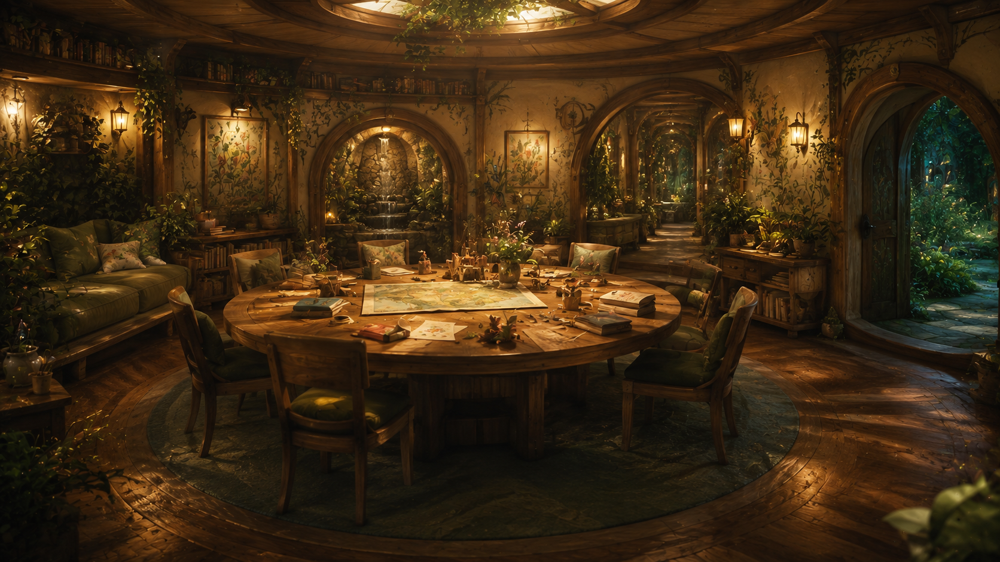

**Runtime:** bg family_home · visuals.rpy:14 · script.rpy:34. [Original image](../../../visual-novel/game/images/backgrounds/family-home.png).

**Story locator:** revision/latest.md:61–81; central room, branching halls and adjacent private rooms. script.rpy:51–52; garden folds around the home..

**Visible evidence:** A central table, books and drawings, close seating, a small fountain and several arched thresholds. The room feels occupied and sheltered.

1. Table, books and work in progress establish everyday occupation.
2. Successive arches connect parts of a dwelling; private rooms continue beyond this shared room.
3. Household outdoor space can adjoin the room without making every planted space public.

**Proposed interpretation:** Treat this as the shared central room of one connected dwelling. Account for the whole household program: private rooms and adult retreats, Arin’s workshop, Selene’s music room, Dorian’s library, Sage’s room, cooking, art and practical support. Some attachments and overlaps remain unresolved. Its garden is ordinary household outdoor space.

**Not established:** The frame does not show the whole dwelling or establish its area. Separate arches are not separate houses. The author identifies the household garden as ordinary, without an implication of unusual wealth.

## Arin’s workshop: making, learning and ongoing projects

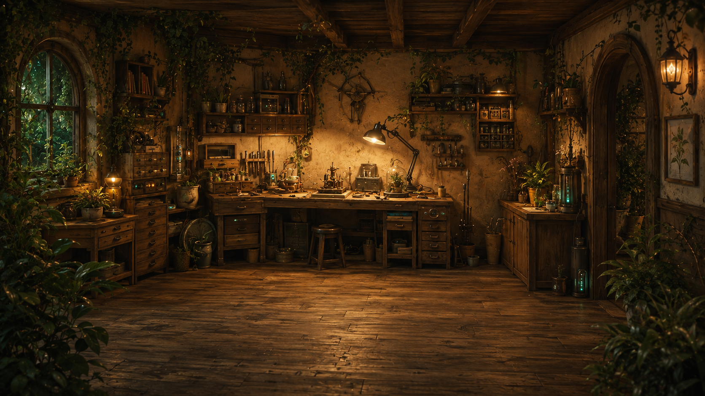

**Runtime:** bg workshop · environments_book_one.rpy:20. [Original image](../../../visual-novel/game/images/backgrounds/book-one/workshop.png).

**Story locator:** revision/latest.md:111; revision/latest.md:231; visual-novel/game/family_book_one.rpy:80; visual-novel/game/friendships_book_one.rpy:117.

**Visible evidence:** Broad rear workbench and side benches/drawers, tools and small mechanisms, stool, timber floor, planted window left and doorway right.

1. An equipped bench carries mechanisms and work in progress.
2. Drawers, tools and open floor support the hands-on workshop scenes.
3. An arched doorway continues into planted interior space; its destination is not established.

**Proposed interpretation:** Closely associated with home life; the VN opening hears its hum and the daily montage returns here. Its doorway opens to further planted interior space in the art.

**Not established:** Exact attachment to the dwelling and work/service access. Do not replace it with Soren’s workshop, the construction equipment room or a generic community workroom. Preserve both personal experimentation and useful engineering.

## Selene’s music room: practice and shared learning

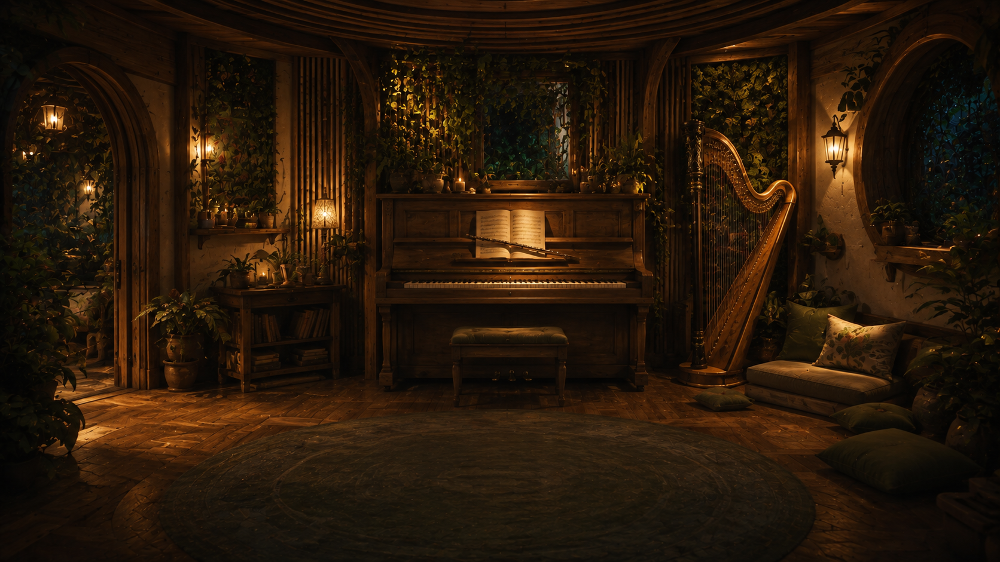

**Runtime:** bg music_room · environments_book_one.rpy:14. [Original image](../../../visual-novel/game/images/backgrounds/book-one/music-room.png).

**Story locator:** revision/latest.md:237; revision/latest.md:237; visual-novel/game/family_book_one.rpy:125.

**Visible evidence:** Piano and shared bench center, harp and soft seating right, hallway doorway left and planted window openings.

1. The piano and shared bench support Cali and Selene’s lesson.
2. The harp and nearby cushions need their own usable space.
3. The doorway connects to a hall, also explicit in the scene text.

**Proposed interpretation:** Within the home’s soundscape; the VN explicitly approaches Selene’s door along a hall.

**Not established:** Acoustic/privacy control and room dimensions; possible relationship to Selene’s personal retreat. Sound must still reach the home in the existing scenes.

## Dorian’s library: maps, reading and stories

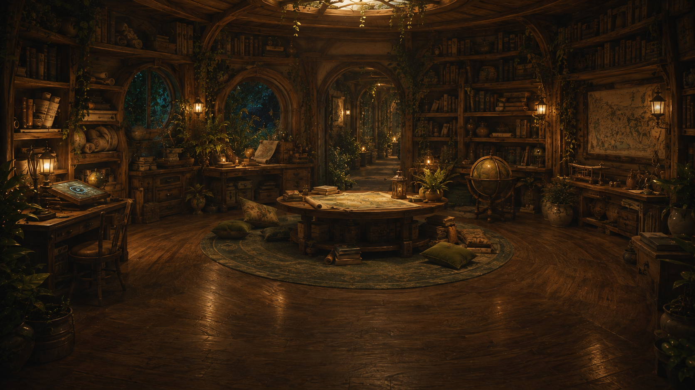

**Runtime:** bg library · environments_book_one.rpy:7. [Original image](../../../visual-novel/game/images/backgrounds/book-one/library.png).

**Story locator:** revision/latest.md:137; revision/latest.md:139; revision/latest.md:241; visual-novel/game/family_book_one.rpy:193.

**Visible evidence:** Books/scrolls around a map table and reading area, additional work surfaces, windows, overhead light and corridor through rear arch.

1. A map table and surrounding cushions form a reading and storytelling area.
2. Books and scrolls occupy the room, with additional work surfaces below.
3. The rear arch opens to a corridor; its route to the home remains to be placed.

**Proposed interpretation:** A recurring destination in the family routine. Its exact connection to the home’s central room is not mapped.

**Not established:** Exact attachment, archive extent and use by outside listeners. Do not reduce it to the central room’s bookshelf or identify it as the whole community archive.

## Sage’s room: personal retreat and quiet company

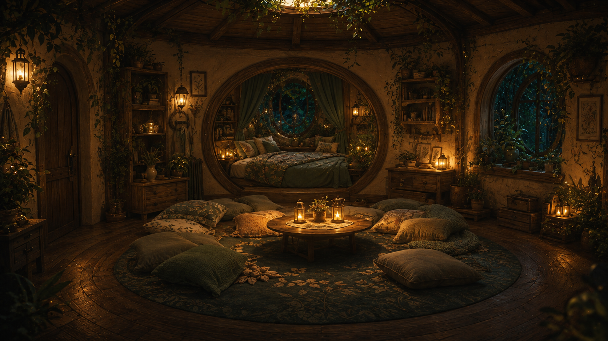

**Runtime:** bg sage_room · environments_book_one.rpy:15. [Original image](../../../visual-novel/game/images/backgrounds/book-one/sage-room.png).

**Story locator:** revision/latest.md:149; revision/latest.md:153; visual-novel/game/family_book_one.rpy:271.

**Visible evidence:** Cushioned gathering around low table, sleeping alcove behind, door left, window right; personal and welcoming uses in one room.

1. A furnished sleeping alcove is part of the room’s visual guide.
2. The low table and cushions provide room for Sage and the three children.
3. The text hears the household fountain beyond this door; exact adjacency is open.

**Proposed interpretation:** In the home; the fountain can be heard beyond Sage’s door.

**Not established:** Precise adjacency and degree of acoustic/visual privacy. This household room does not establish that professional transition counseling always happens here.

## Soren’s workshop: a distinct place for systems work

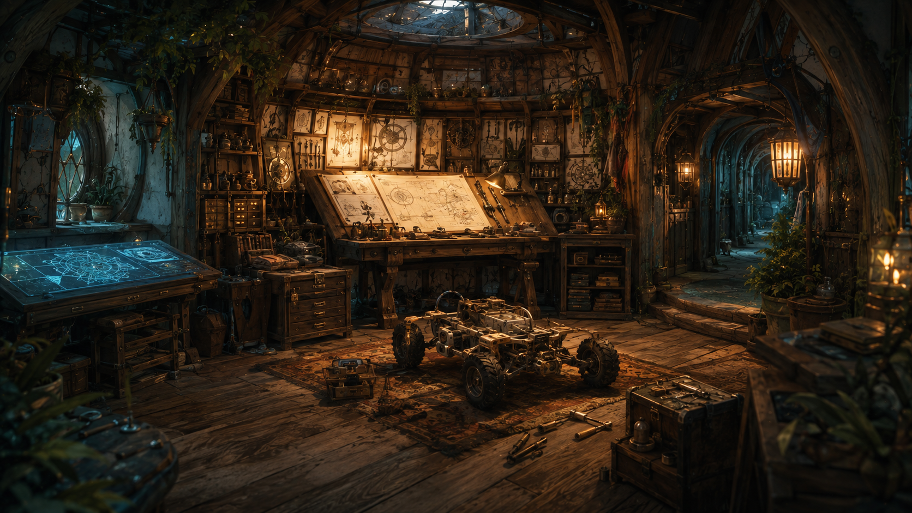

**Runtime:** bg soren_workshop · environments_book_one.rpy:16. [Original image](../../../visual-novel/game/images/backgrounds/book-one/soren-workshop.png).

**Story locator:** revision/latest.md:369; visual-novel/game/friendships_book_one.rpy:66; visual-novel/game/friendships_book_one.rpy:80.

**Visible evidence:** Drafting bench and plans, tool drawers, work surfaces, floor rover prototype and arched corridor at right; distinct from Arin’s shop.

1. The drafting bench and plans support the rover design scene.
2. A floor prototype needs working room around it.
3. The arched passage provides visible depth without establishing attachment to Joren’s home.

**Proposed interpretation:** Associated with Joren’s family home; exact attachment is unspecified.

**Not established:** Work/service access, noise and equipment needs. Keep this separate from Arin’s personal workshop and the construction equipment room.

## Cassia’s home: daily life among art and living systems

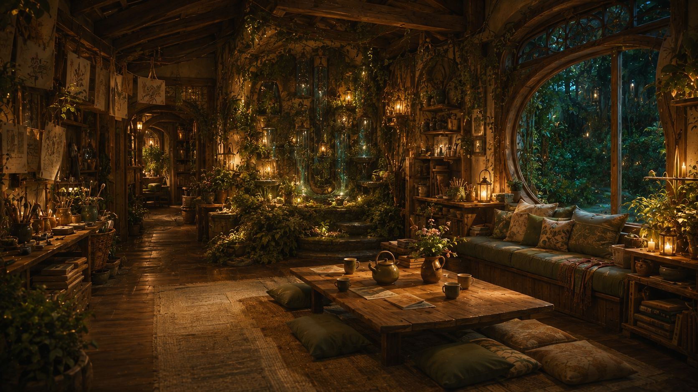

**Runtime:** bg cassia_home · environments_book_one.rpy:2. [Original image](../../../visual-novel/game/images/backgrounds/book-one/cassia-home.png).

**Story locator:** revision/latest.md:361; visual-novel/game/friendships_book_one.rpy:14; visual-novel/game/friendships_book_one.rpy:56.

**Visible evidence:** Craft surfaces/books, drying drawings, tea table and seating; planted water feature and another room through a rear-left arch.

1. Tea and drawings occupy the central table and nearby seating.
2. Art materials and drying drawings make creative work part of the home.
3. Another furnished space is visible through the arch; this is not the whole dwelling.

**Proposed interpretation:** Reachable by household visits; no exact adjacency to Cali’s home.

**Not established:** Complete domestic program and personal rooms remain undescribed. Thalia’s mediation profession and Lyron’s agricultural work do not locate their workplaces inside this room.

## Courtyard: social life among cultivated structure

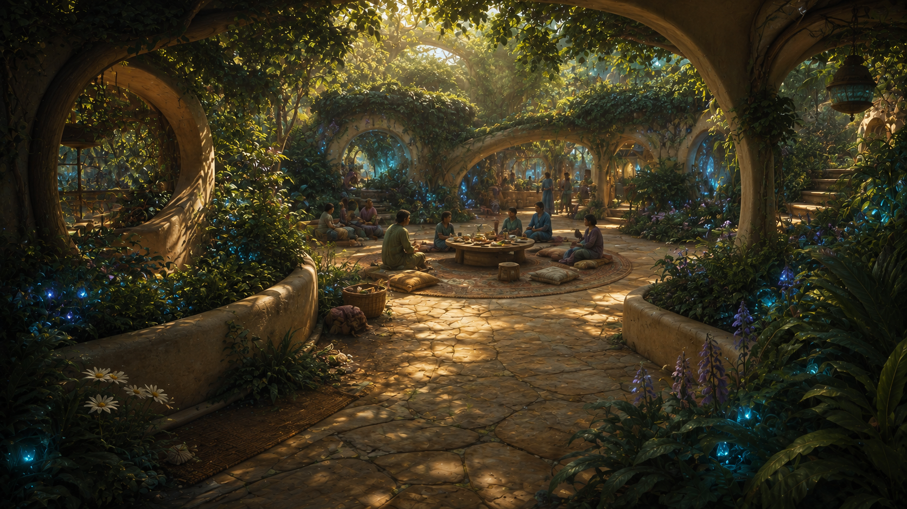

**Runtime:** bg community_courtyard · visuals.rpy:15 · script.rpy:102. [Original image](../../../visual-novel/game/images/backgrounds/community-courtyard.png).

**Story locator:** revision/latest.md:57; connected paths, gardens and plazas.

**Visible evidence:** A low shared table is surrounded by intimate seating, planted edges and curved adjoining passages. Light is filtered through canopy.

1. Seated people and the table establish a small social scale.
2. A curved passage carries the scene beyond its immediate gathering space.
3. Canopy and planted overhead connections create filtered enclosure.

**Proposed interpretation:** Distinguish courts used by nearby households from household interiors and gardens, and from larger community plazas. Connect them through shared paths and recognizable domestic thresholds.

**Not established:** This frame does not establish that every court has the same plan, or that all residents share this one court.

## Garden and oak: two related inhabited heights

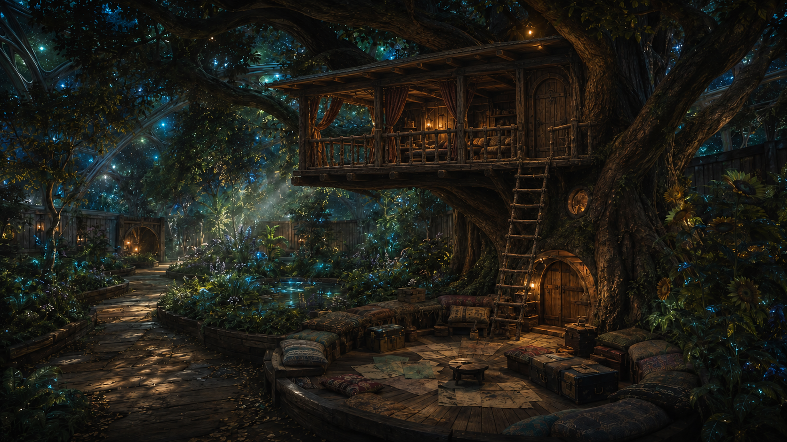

**Runtime:** bg garden · visuals.rpy:12 · script.rpy:177; treehouse entrance sequence. [Original image](../../../visual-novel/game/images/backgrounds/garden.png).

**Story locator:** revision/latest.md: treehouse chapters; oak, ladder and separate lower hollow.

**Visible evidence:** The upper room sits among the oak branches. A ladder meets its right-hand entrance; a separate lower hollow and broad seating refuge occupy the bank below.

1. Upper room: handmade, inhabited and sheltered by branches.
2. The ladder connects to the upper entrance; the lower hollow is separate.
3. A broad refuge sits at garden level. Root and drainage volume must fit beneath it.

**Proposed interpretation:** Give the oak genuine rooting depth and canopy clearance in the broader shared wooded garden edge. Keep the nearby household garden distinct from the more shared treehouse surroundings; preserve the upper entrance, ladder and lower refuge.

**Not established:** This oak is not the Tree of Echoes. Its visible scale does not determine the material or size of Lumen’s main structural supports.

## Treehouse interior: intimacy survives verticality

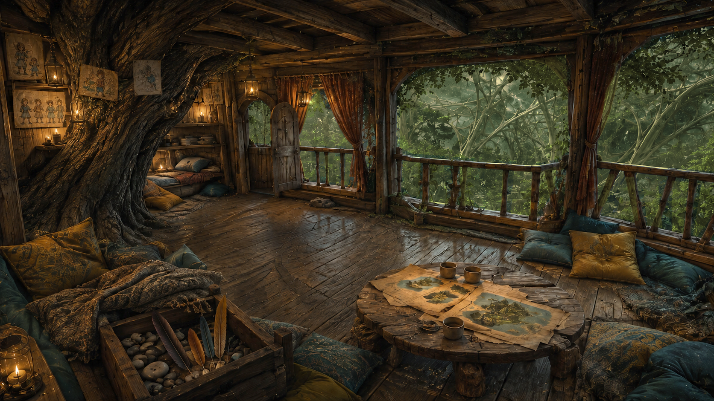

**Runtime:** bg treehouse · visuals.rpy:17 · script.rpy:187; actor staging in visuals.rpy:24–28. [Original image](../../../visual-novel/game/images/backgrounds/treehouse-shaded.png).

**Story locator:** revision/latest.md: patchwork treehouse, open cutouts and curtains.

**Visible evidence:** The oak crosses the room. The roof is low, the bays open to foliage, and curtains, cushions, drawings and a map table make a personal refuge.

1. The diagonal oak is part of this room’s geometry.
2. Arched doorway and nearby floor must connect to the exterior landing.
3. Open bays, rails and curtains preserve the outdoor refuge experience.

**Proposed interpretation:** Reconstruct the room, door, landing and canopy as one local space before placing it in the world. Preserve the supported floor and open edge.

**Not established:** Its camera and furniture are guides, not a calibrated orthographic drawing; far views do not prove an unobstructed ship-wide sky.

## Pond action CG: small geometry carries the story

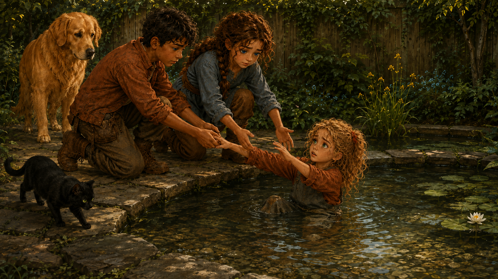

**Runtime:** cg pond_rescue · visuals.rpy:6 · family_book_one.rpy:444; bg garden_pond at :439. [Original image](../../../visual-novel/game/images/cg/book-one/pond-rescue.png).

**Story locator:** revision/latest.md: Lyra’s pond incident.

**Visible evidence:** The rescuers kneel on a broad dry bank beside very low stone coping. The small planted pond, child and reaching hands define the action.

1. Hands and low bank make the rescue physically readable.
2. A small basin supports the scene; exact depth requires comparison with the background.
3. Dry standing/kneeling room and familiar access are part of the place.

**Proposed interpretation:** Keep the bank reachable and the pond local to the garden. Reconcile this action framing with the garden-pond background in the local model.

**Not established:** The CG does not calibrate exact water depth. It does not justify converting the pond to a deep reservoir, canal or exposed drop.

## Construction path: living structure and work coexist

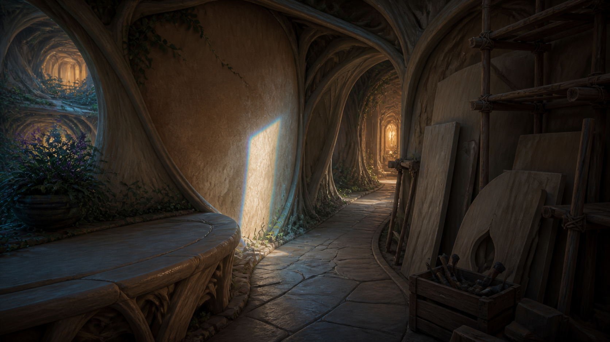

**Runtime:** bg construction_path · visuals.rpy:16 · script.rpy:141; friendships_book_one.rpy:158,221. [Original image](../../../visual-novel/game/images/backgrounds/construction-path.png).

**Story locator:** revision/latest.md:431; machinery, metal, welding and scaffolds.

**Visible evidence:** Thick branching supports frame a bending path. The left opens onto another occupied height. Scaffolds, boards, rope and tools occupy the foreground.

1. Branching support frames a view across a separate inhabited height.
2. The path turns through structure into further occupied space.
3. Scaffolding and fabricated pieces are visible parts of construction.

**Proposed interpretation:** Let growth fronts attach to existing neighborhoods. Retain unfinished work, material staging and routes passing through thick structure.

**Not established:** The painted supports’ wood-like appearance does not identify the load-bearing material throughout the vessel.

## Construction room: technology remains usable

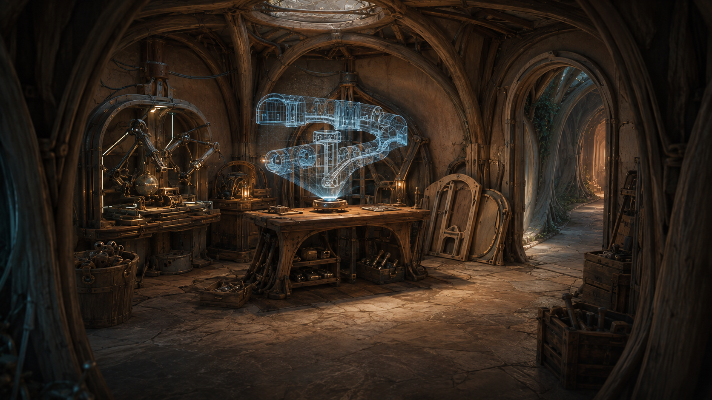

**Runtime:** bg construction_room · environments_book_one.rpy:21 · friendships_book_one.rpy:177. [Original image](../../../visual-novel/game/images/backgrounds/book-one/construction-room.png).

**Story locator:** revision/latest.md: construction exploration; tools, metal and machinery.

**Visible evidence:** A furnished workroom contains mechanisms, tools, components and a projected design. An arched side door connects directly to the grown passage.

1. Mechanisms and tools allow real making, inspection and repair.
2. A visible technical interface; its depicted design does not define Lumen’s anatomy.
3. The workroom joins the same tangible passage network.

**Proposed interpretation:** Embed usable workshops and staging rooms within growth areas. Physical tools and interfaces work alongside advanced systems.

**Not established:** The projected design is not a ship plan, a canon gravity mechanism or proof that every wall can instantly transform.

## Dome overlook: the principal reference for connected depth

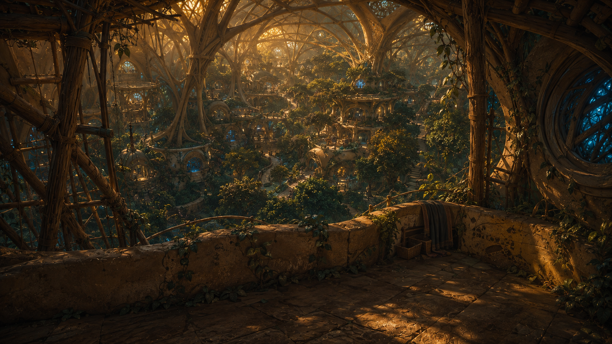

**Runtime:** bg dome · environments_book_one.rpy:3 · friendships_book_one.rpy:235–247. [Original image](../../../visual-novel/game/images/backgrounds/book-one/dome.png).

**Story locator:** revision/latest.md:447–453; local unfinished dome and scaffold ascent.

**Visible evidence:** An internal stone parapet and scaffolds overlook overlapping gardens, paths, rooms and inhabited terraces at many heights. Large grown supports continue beyond the view.

1. Foreground platform and scaffold establish the local ascent viewpoint.
2. Many occupied heights overlap through depth; this is the central spatial relationship to preserve.
3. Rooms, foliage and supports continue beyond the immediate opening.

**Proposed interpretation:** Use branching inhabited structure and multiple connected view volumes. The local overlook reveals a wider pattern without displaying the whole ship.

**Not established:** No exterior silhouette, exact span, total population, roof type or single global ground plane can be measured from this image.

## Festival: a social focus with occupied galleries

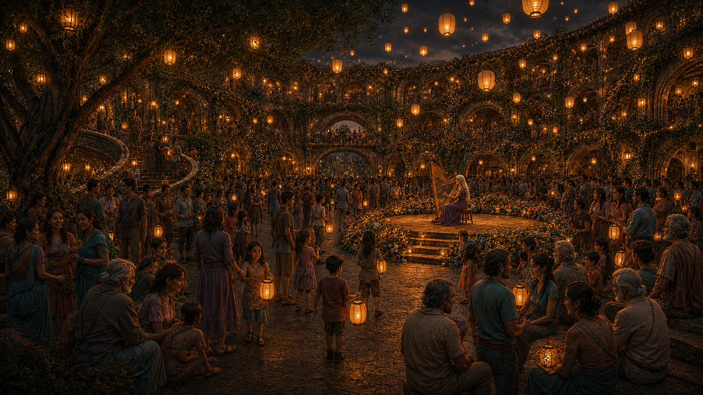

**Runtime:** bg festival · environments_book_one.rpy:5 · family_book_one.rpy:517–556. [Original image](../../../visual-novel/game/images/backgrounds/book-one/festival.png).

**Story locator:** revision/latest.md:323; entire-community Festival of Lights.

**Visible evidence:** An intimate performance platform, a curved stair at left, occupied upper galleries and a rear passage support a crowded gathering under lanterns.

1. Small stage and nearby listeners give the event its intimate scale.
2. People occupy upper galleries as well as the court.
3. A rear passage continues beyond the foreground gathering; its capacity is unknown.

**Proposed interpretation:** Treat the named central plaza as a connected civic place with real approaches and multiple occupied heights, within a distributed world.

**Not established:** Visible galleries do not establish total gathering capacity. Keep the manuscript’s whole-community claim open for a measured test; do not infer a census from painted heads.

## Tree of Echoes: a distinct heritage grove

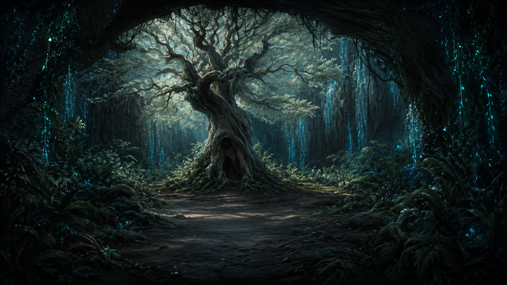

**Runtime:** bg echoes · environments_book_one.rpy:4 · family_book_one.rpy:386. [Original image](../../../visual-novel/game/images/backgrounds/book-one/echoes.png).

**Story locator:** revision/latest.md: Tree of Echoes passage; wiki/worldbuilding/Lumen.md.

**Visible evidence:** A single gnarled hollow tree stands in a deeply enclosed, shaded grove with trailing vegetation and cool local light. No treehouse is visible.

1. The hollow heritage tree remains distinct from the children’s oak.
2. Layered canopy and enclosure make a sheltered, reflective place.
3. Small local light sources shape mood; they do not establish the crop-energy supply.

**Proposed interpretation:** Place this as a quieter, distinct place within the garden network. Give its tree a credible root zone; preserve its role in Lumen’s gradual revelation.

**Not established:** The tree is not evidence for a sole ship-wide trunk, a central brain or the oak treehouse’s location.

## Narrative and production scope

Read the plates alongside [script.rpy](../../../visual-novel/game/script.rpy), [family_book_one.rpy](../../../visual-novel/game/family_book_one.rpy), [friendships_book_one.rpy](../../../visual-novel/game/friendships_book_one.rpy), [visuals.rpy](../../../visual-novel/game/visuals.rpy) and [environments_book_one.rpy](../../../visual-novel/game/environments_book_one.rpy). The source locators refer to the recorded revision and may move in later edits.

The [space inventory](../Lumen-Space-Inventory.md) records a full read of Book I in [latest.md](../../../revision/latest.md) and the current VN narrative. Earlier study references to later books and the [timeline](../../../wiki/TIMELINE.md) do not constitute a full all-books spatial audit. The [adaptation guide](../../../visual-novel/docs/ADAPTATION.md), [art direction](../../../visual-novel/docs/ART_DIRECTION.md) and [location continuity record](../../../visual-novel/docs/location-continuity.json) supply production context. The author's current VN-first instruction supersedes the older external-reference ranking in the art guide.

All 49 location/state/action/closing-theme images are inspected and mapped in the inventory, including the pond, rain/later treehouse, memorial plaza and home painting/grief states. These sixteen annotated plates are a selection. The household and neighborhood sketches are withdrawn as layout bases; a complete spatial reconstruction remains to be done. Dream scenes and places represented in stories or pictures are not measurements of physical Lumen.
