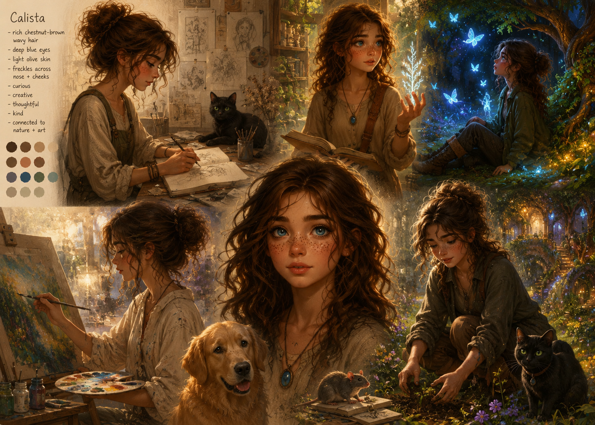
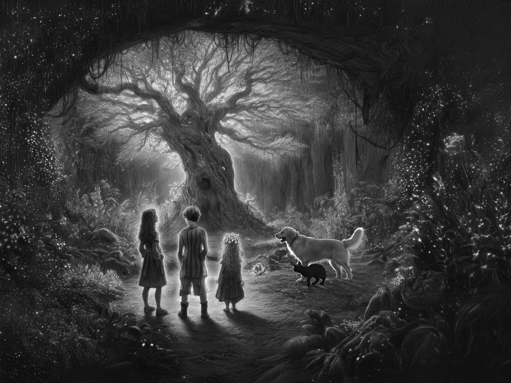
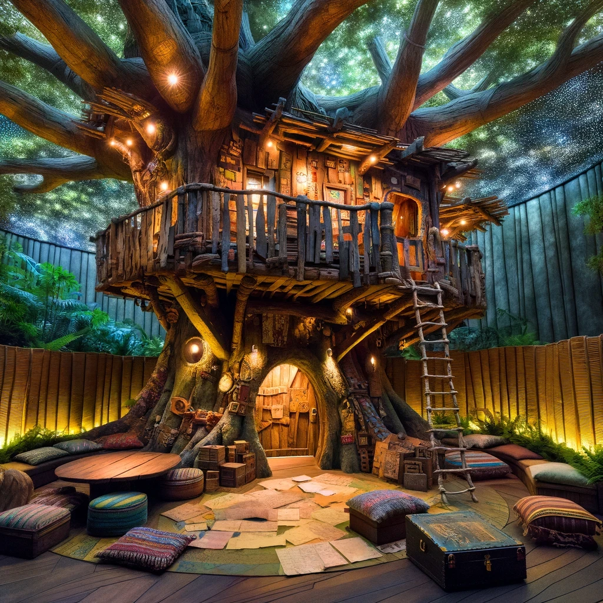

# Book I: Seeds of Youth (In Draft)
## Earliest Memories

My earliest memories are of stories told to me by my parents. They spoke of my First Breath and taking me home from the Sanctuary, holding me in their waiting arms. They described the warmth and joy of that moment, their excitement as they welcomed me into their lives. Though I don't remember my First Breath, the way they recounted it made it feel almost tangible.

_Did I ever really understand the depth of their joy? They must have been so nervous, bringing a new life into the world. I wonder if they ever doubted themselves, felt overwhelmed by the responsibility. Their stories always made it sound so perfect, but surely there were moments of uncertainty and fear. How did they cope with those feelings?_

They also mentioned how Shadow, our cat, curiously watched over me, her eyes glinting in the low light, and how Barkley, our golden retriever, gently nudged my tiny hands with his nose, his fur soft and comforting. Meanwhile, Nibble, our inquisitive rat, was always exploring, her tiny feet tickling as she scurried around my crib.

Lumen, the child of Aurora and Nyx, was a world still in its infancy, with its population largely composed of the first generation born and raised within its nurturing embrace. As Astraviin, we shared a deep and intimate connection with our home, drawing strength and wisdom from the legacy of Aurora and Nyx. This close relationship with Lumen influenced every aspect of our lives, fostering a sense of unity and purpose within our community.

_How did this bond shape us so profoundly? Was it the stories of Aurora and Nyx, or was it something deeper, something almost spiritual? I sometimes wonder if our connection to Lumen was more than just cultural. It felt like a living, breathing relationship, one that guided our actions and decisions, one that gave us an unshakeable sense of belonging. Was it the same for everyone else, or did some feel lost, disconnected?_

In Lumen, constellations were a common part of the community's structure. These units, formed by multiple adults to create new families, were essential to the growth and cohesion of our society. Given the youthful and expanding population at the time, these constellations often included more members than usual.

_Why did we feel so compelled to form such intricate bonds? Was it the influence of our environment, or something inherent in our nature? These constellations weren't just about survival; they were about thriving, about building something greater than ourselves. Did we instinctively know that unity was our strength?_

While some individuals chose not to participate in these groupings or to raise children, there was a strong cultural emphasis on building and nurturing the new generation. This led to the formation of larger family units, with some expanding beyond the typical two to three members, reflecting our collective commitment to the future of Lumen.

My parents were part of one such diverse and loving constellation, with five adults raising three children-a rarity even in Lumen. Each of my parents brought unique strengths and perspectives to our family.

_Truly, How did they manage to juggle everything so seamlessly?_

Maia, an ecological systems designer, had a profound love for vibrant, living things. She was tall and slender, with warm brown skin and long, silver-streaked dark hair woven into elaborate braids that often held small seeds or dried flowers. Her hands were always warm and gentle, capable of coaxing life from the soil.

_She turned our home into a living, breathing garden._

Arin, a biomechanical interface designer, could fix anything with skillful precision. With short-cropped auburn hair, sharp blue eyes, and a lean, muscular build, Arin moved with the confidence of someone who understood how things worked, whether they were machines or the complexities of daily life.

_Arin's steady hands brought a sense of security. Watching them work was like witnessing a kind of magic, transforming chaos into order with such ease. Their confidence was infectious, making even the most daunting problems seem solvable._

Selene, an acoustic architect, created melodies that soothed any trouble. She had a graceful presence, with her flowing white hair and piercing violet eyes. Her fingers were long and delicate, dancing effortlessly across the strings of her harp or the keys of her piano, filling our home with music that seemed to resonate with our very souls.

_Her music was like a spell, calming and enchanting us all. I wonder when I will be able to hear it again._

Dorian, an oral historian, kept the stories of our people alive with his rich narratives. He was a tall, broad-shouldered man with deep-set brown eyes and a voice that could captivate any audience. His hair was a mix of gray and black, always neatly trimmed, and he wore glasses that perched on the bridge of his nose as he pored over ancient texts and scrolls.

Finally Sage, the transition counselor, had a nurturing presence that brought a sense of calm to our home. With soft, kind eyes and a gentle smile, Sage exuded tranquility, making everyone feel safe and loved. Their short, sandy hair framed a freckled complexion, and their soothing voice could ease any troubled heart.

My own appearance reflected the diverse genetics of Lumen's heritage. My hair was a rich chestnut brown, often falling in loose waves around my face. My eyes were a deep blue, curious and ever-watchful, taking in the wonders of the world around me. I had a light olive complexion, and a smattering of freckles across my nose and cheeks, a blend of the many influences in our community.

_I wonder what stories my features would tell if they could speak. Each freckle, each strand of hair, a tiny piece of our shared history._

Alongside me were my older brother, Kael, and my younger sister, Lyra. Kael was adventurous and brave, with tousled dark hair and bright, hazel eyes that sparkled with mischief. He was tall for his age, lean and always ready for the next adventure.

_Oh. Always the daring one. Never afraid to leap into the unknown. Sure got us into trouble more than once. Though I suppose I'm no more innocent._

Lyra was curious and full of questions, with golden curls and wide, green eyes that seemed to see everything. She was small and sprightly, always moving, always exploring.

Our familiars were just as important to my childhood. Shadow, the cat, with her striking green eyes; Barkley, the loyal golden retriever with his boundless energy; and Nibble, the small but curious rat.

_What did I do to deserve such loyal companions? Each of them brought something unique to my life, from Shadow's quiet wisdom to Barkley's boundless enthusiasm and Nibble's curious explorations. They were part of our family, each adding their own special charm to our daily lives._

_Hmm. Ah. Yes. I suppose you're right Shadow._

The world in which we lived, Lumen, was a place of wonder, a young and vibrant community that seamlessly blended nature and subtle technology. It was a sprawling environment filled with interconnected pathways, lush gardens, and open plazas. Pathways lined with bioluminescent plants illuminated the way, casting a soft glow during the evening hours.

_Walking through those glowing paths felt like stepping into a dream. Each step seemed to whisper secrets of the past, stories of the present, and promises of the future. The bioluminescent plants, like guardians of the night, would light our way, ensuring we were never lost in the dark._

Our home itself had a cozy central room filled with light. In the center stood a large, round table made from smooth, polished wood, perfect for family meals and gatherings. Comfortable seating areas with soft, cushioned chairs and sofas were arranged around the room, creating inviting spots for reading, talking, or simply relaxing. Light filtered through ceiling panels, casting a warm glow over everything.

_That table saw so many stories and laughter. It was the heart of our home, where we shared meals, dreams, and even the occasional tear. Each nick and scratch on its surface held a memory, a testament to the countless moments that wove the fabric of our family life._

The sound of gently trickling water from a small indoor fountain added to the serene ambiance, making it a perfect place for both quiet moments and lively conversations. Shadow often lounged on the back of a sofa, her green eyes watching us calmly. Barkley would greet everyone enthusiastically, his tail wagging, while Nibble had a cozy cage in the corner but was often let out to explore, scurrying around with endless curiosity.

_How many secrets did Shadow keep, lounging there in her quiet wisdom? She always seemed to know when I needed comfort, her purrs a soothing balm to any worry._

The hallways branching out from the central room led to different parts of our home. Each hallway was lined with bioluminescent plants that gently glowed in the evening. The walls of the hallways were adorned with living murals that shifted and changed, displaying scenes from nature, abstract patterns, or interactive art that responded to our touch.

_The hallways always felt like they were alive, shifting with our moods, reflecting the ever-changing nature of our lives. Each mural was a story waiting to be told, a dance of colors that seemed to breathe along with us._

Each of us had our own private space within our home. My room was my sanctuary. The walls were a soft, calming hue, adorned with my drawings and little creations from my adventures around Lumen. My bed was nestled in a cozy alcove, piled high with soft pillows and a warm quilt. Shelves lined with books, both old and new, and a variety of trinkets I had collected over the years added a personal touch. A small desk sat by the window, where I spent hours sketching the world outside or lost in a book. Shadow would often curl up beside me as I sketched or read, her presence calming and comforting.

_My room was my haven, filled with dreams and quiet moments. Each item held a memory, each drawing a piece of my heart._

Kael's room was next to mine, reflecting his adventurous spirit. His space was filled with maps and models of places he dreamed of exploring. His bed was a loft, and underneath it was a fort made of blankets and pillows, where he often read or planned his next adventure. Barkley loved joining Kael in his adventures, whether it was a blanket fort or a backyard expedition.

_Kael's room was always a mess of dreams and plans, a testament to his boundless energy and imagination._

Lyra's room was on the other side of mine, filled with her curious collections and projects. She had jars of colorful stones, feathers, and pressed flowers. Her bed was surrounded by shelves of books and educational games, and her walls were covered with her own vibrant drawings. Nibble was Lyra's favorite companion during her curious explorations, often perched on her shoulder as she studied her collections of stones and feathers.

_Her curiosity seemed endless, always discovering new treasures and asking questions that made us all think. And I suppose that never really changed as she grew up._

While I loved spending time with all of my family, one of my favorite activities was spending time in Maia's garden. The vibrant colors and sweet fragrances made it a place of endless wonder. Maia's gentle guidance turned gardening into a magical experience.

"Here, Cali," Maia said one morning, handing me a small seed. "This seed will grow into a beautiful flower if we take good care of it."

I held the seed carefully, feeling its tiny, smooth surface. "What kind of flower will it be?"

"A sunflower," she replied with a warm smile. "Tall and bright, just like you."

Together, we dug a small hole in the rich, dark soil. Maia's hands guided mine as we planted the seed and covered it with earth. She explained how the seed would sprout and grow, reaching for the skylight.

"Remember, plants need love and patience," Maia said. "Just like people."

_Did I ever give enough love and patience to those around me? How much did I learn from these moments in the garden with Maia?_

Of course, not all moments were serene. One afternoon, while arranging new plants in the garden, Kael and I had a disagreement about where to place them.

"I think they should go here," Kael insisted, pointing to a bright spot.

"But they'll look better near the pond!" I argued, crossing my arms.

Our voices grew louder, attracting Maia's attention. She walked over and placed a hand on each of our shoulders.

"Both of your ideas have merit," she said calmly. "Why don't we try a bit of both? Compromise often leads to the best results."

We followed her suggestion, and as we worked together, I realized that combining our ideas did indeed create a more beautiful arrangement. It was a lesson in cooperation and respect.

Arin's workshop was a place of fascination and learning. The air was filled with the metallic scent of machinery and the hum of various gadgets.

One day, while Arin was working on a new device, I accidentally knocked over a jar of screws, sending them scattering across the floor.

"Oh no!" I exclaimed, feeling a wave of guilt. "I'm so sorry, Arin."

Arin stopped humming-the rhythmic tune they made while working-and surveyed the mess, already sorting pieces with practiced efficiency. "That's quite a spread," they said, a half-smile playing at their lips. "Could use a system for this."

_How many times did I worry about making mistakes? Did I realize then how much each mistake was an opportunity to learn and grow?_

"But I interrupted your work," I said, my voice small.

Arin's sharp blue eyes met mine, their expression steady-practical, but kind. "Cali, look at me. Mistakes happen. Even the best machines break down sometimes-that's how we learn what needs reinforcing. The important thing isn't the fall. It's what we build after." They chuckled-a sound almost like gears clicking into place. "Let's troubleshoot this together."

With Arin's guidance, I gathered the scattered screws and sorted them by size, learning how a little order could make the next task easier.

Evenings were often filled with the soothing sounds of Selene's music. Her melodies seemed to wash away the day's worries, creating an atmosphere of peace.

"Come sit with me, Cali," Selene hummed, her voice melodic even in speech, patting the seat beside her at the piano. She swayed slightly, as she always did, as if hearing rhythms invisible to the rest of us.

I sat down, and she placed a small flute in my hands, turning it in the light. "Do you see how it shines?" she asked, almost singing the words. "Music lives inside, waiting to wake up. Like a dream that hasn't been dreamed yet."

I took a deep breath and began to play. The notes were shaky at first, but Selene's encouraging smile gave me confidence. Gradually, the notes became clearer.

Selene's violet eyes half-closed as she listened. "There-do you hear that color? Pale blue, like morning sky. A little shy, a little soft. But beautiful." She hummed a few notes in harmony with my playing. "Music speaks to the heart, little one. You just have to listen-and let yourself feel what the sounds are saying."

Dorian's library was a sanctuary of stories and knowledge. Every night, he would gather us for storytime, weaving tales of our ancestors and distant lands.

Dorian stood at the head of the reading area, his broad hands resting on an ancient map's edges. When he spoke, his deep voice seemed to rise from somewhere within the very walls-resonant and commanding.

"And so, the historian gathered his young listeners close, for tonight-" He paused dramatically, letting the silence build. "-they would hear of the great explorers of our past."

Kael's eyes sparkled with excitement. "Can we follow their routes one day?"

Dorian smiled, his eyes twinkling with the thrill of storytelling. "Perhaps. But first, we must learn their stories. A traveler who does not know the past is merely lost. A traveler who carries history with them? They are never alone."

The library's cozy atmosphere, with its soft lamp glow and the rustle of pages, made these stories feel alive. Each tale was a lesson in courage, resilience, and the importance of our heritage.

Sage was always there to mend a scraped knee, offer a comforting hug, or provide wise counsel during difficult times. Their room, a haven of peace, was filled with soft cushions, warm blankets, and the gentle glow of candlelight, making it the perfect place for quiet moments and bedtime stories. Sage's ability to listen and provide care made them an integral part of our family, embodying the essence of love and compassion.

_Did I ever truly appreciate the quiet strength and endless patience Sage showed us? How often did their wisdom guide me through life's challenges?_

One evening, after a particularly lively day, we gathered in Sage's room. Lyra had been upset earlier after a disagreement with Kael about who would get the last piece of dessert. Sage sensed her lingering sadness and gently lifted her onto their lap.

"Do you know what helps when we're feeling down?" Sage asked softly. Lyra shook her head. "A good story," Sage continued, "and a reminder that even when we disagree, we are always there for each other."

Sage began to tell a story about three siblings who learned the value of cooperation and understanding. As they spoke, the soft light from the candles flickered, casting gentle shadows that seemed to dance to the rhythm of their words. Lyra's frown slowly turned into a smile, and she nestled closer, comforted by Sage's presence. Kael and I listened intently, the lesson not lost on us either.

"Once upon a time, aboard a great Astravus traveling through the cosmos, there were three siblings: Aria, Bram, and Cora. They lived within the living ship, surrounded by intricate pathways, vibrant communal areas, and the hum of advanced technology. The three siblings were very different from one another. Aria was adventurous and loved exploring the far reaches of the ship, Bram was thoughtful and enjoyed solving intricate puzzles, and Cora was creative, always crafting beautiful art from the materials around them.

One day, their community faced a problem. The central water system that provided for all the living quarters had run dry, and no one knew why. The residents were worried and didn't know what to do. Seeing the concern on everyone's faces, the three siblings decided to help.

'Let's explore the far sections of the ship and find a new source of water,' Aria suggested, eager for an adventure.

'We should think this through and find out why the system went dry in the first place,' Bram said, wanting to understand the problem.

'Why don't we create something that can help us find the answer?' Cora added, ready to use her creativity.

At first, they argued about whose idea was best. They each thought their own way was the only way to solve the problem.

'Your plan is too risky,' Bram told Aria. 'We don't have time to wander aimlessly through the ship.'

'And your plan is too slow,' Aria shot back. 'The community needs water now!'

Cora sighed. 'We can't just sit here arguing. We need to do something.'

After a heated discussion, they decided to try each of their ideas in turn. They set off on Aria's plan first, venturing to the far reaches of the ship. They searched for hours but found no new source of water. Exhausted and disheartened, they returned to the central hub.

Next, they tried Bram's plan. He meticulously examined the central water system and the surrounding infrastructure, eventually discovering that the pipes had been clogged by mineral deposits from the ship's filtration system. But clearing the pipes was slow, tedious work, and the community was growing more anxious by the hour.

'This isn't working fast enough,' Aria said, frustration evident in her voice.

Cora, observing their struggles, had an idea. 'What if we use my filtration system to speed up the process?' she suggested. She had been working on a small-scale filtration device for her art projects, which could potentially clear the mineral deposits more efficiently.

Combining Bram's knowledge of the infrastructure with Cora's filtration system, they managed to clear the pipes much faster. Water began to flow back into the system, and the community sighed with relief.

'We couldn't have done it without each other,' Aria admitted, looking at her siblings with newfound respect.

'Our different strengths made us stronger together,' Bram agreed.

'And our willingness to listen and adapt helped us succeed,' Cora added.

From that day on, the siblings remembered the power of cooperation and understanding, knowing that together, they could overcome any challenge. Their community thrived, thanks to the lessons learned by three siblings who understood the true value of working together."

As Sage finished the story, the room was quiet, filled with the warmth of their words. Lyra's frown had disappeared completely, replaced by a look of contentment. Kael and I exchanged a knowing glance, the lesson clear and meaningful.

These moments, rich with love, learning, and togetherness, were the essence of our family life. They taught us valuable lessons about cooperation, patience, creativity, and resilience.

My early memories are imbued with the warmth and love of my parents and siblings. The smell of fresh bread in the morning, the taste of ripe fruit from Maia's garden, the feeling of Barkley's soft fur, and the sound of Selene's harp, and so many others-all these sensory details enriched my childhood. Each experience flowed seamlessly into the next, painting a vivid picture of my early years and laying the foundation for the person I would become.

In the years that followed, my childhood life revolved around the interactions and relationships within our family. Each day was a blend of structured activities and spontaneous adventures, woven together by the love and support of our parents.

Our mornings began with a gentle routine that set the tone for the day. Sage, with their nurturing presence, ensured we all started the day feeling loved and cared for. The smell of freshly baked bread and the soft hum of a melody from Selene's music room would drift through our home, creating a serene atmosphere.

I would wake to the sight of light shifting across Lumen's sky, casting intricate patterns on my walls. Shadow, our sleek black cat, often curled up at the foot of my bed, would stretch and purr, ready to greet the new day. Barkley, our golden retriever, would be waiting eagerly outside my door, his tail wagging in anticipation of the day's adventures. Nibble, our inquisitive rat, would already be exploring her cage, her tiny feet rustling softly.

Breakfast was a lively affair, with everyone gathering around the large, round table in the central room. Maia would bring in fresh fruit from the garden, while Arin prepared a variety of delicious dishes. The table was always a vibrant display of colors and flavors, reflecting the diversity of our family. Kael, ever the early riser, would recount his dreams from the night before, often involving grand adventures and daring exploits. Lyra, still rubbing sleep from her eyes, would listen with wide-eyed wonder, her curiosity piqued.

"So-" Kael was already pacing around the breakfast table, unable to sit still. "I dreamt I was exploring a hidden cave filled with glowing crystals!" He grabbed a piece of bread, gesturing with it as he spoke, his hazel eyes sparkling with excitement.

"Were there any creatures in the cave? What did they look like? Did they try to stop you?" Lyra asked, leaning forward eagerly, her questions tumbling out in their usual way.

"Of course! There were these small, luminous insects that guided me deeper into the cave," Kael continued, his voice animated as he circled back around the table.

"Sounds magical," I said, smiling at the imagery Kael's story conjured.

Our days were filled with learning and exploration, guided by the unique strengths of each parent. Maia's love for nature led to many hours spent in the garden, where we learned about plants, insects, and the delicate balance of ecosystems. She would show us how to plant seeds, care for growing plants, and harvest the fruits of our labor. Shadow often followed us into the garden, her sleek form weaving through the flowers, while Barkley chased butterflies and Nibble explored the underbrush, adding their unique presence to every adventure.

"Cali, see how this seedling reaches for the light?" Maia explained, kneeling beside the pot. She stroked one of the seedling's leaves with gentle fingers. "You're working so hard, aren't you?" she murmured to the plant, before turning back to me. "It's called phototropism. Plants grow toward light because light is their food, their energy, their life."

I nodded, fascinated by the small miracle of growth unfolding before my eyes. "It's amazing how they know where to grow."

Maia smiled warmly, still gently cradling the young plant. "Nature is full of wonders. And this little one-" she patted the soil tenderly, "-is teaching us patience. Just like people, plants need love and time to flourish."

Arin's workshop was a place of endless fascination. Here, we learned about engineering, mechanics, and the principles of design. Arin's patience and skill made even the most complex concepts accessible. We spent hours tinkering with machines, building small devices, and understanding how things worked. The workshop buzzed with activity, filled with the sounds of tools, the whirr of gears, and the occasional bark of excitement from Barkley as he discovered something new.

"Hand me that wrench, Cali," Arin said one day, focused on a delicate mechanism.

I passed the tool, watching intently as they adjusted the gears. "What are you making?"

"It's a prototype for a new irrigation system," Arin explained. "It will help Maia's garden thrive even more."

"Can I help?" I asked eagerly.

"Of course," Arin replied, their eyes twinkling. "Here, try tightening this bolt."

Selene's music room offered a different kind of learning. Through music, we explored emotions, creativity, and the power of expression. Selene taught us to play various instruments, encouraging us to find our unique voices. The room was always filled with the sounds of music, whether it was the gentle strumming of a harp, the rhythmic beat of drums, or the harmonious notes of a piano. Shadow would often curl up in a corner, her ears twitching in time with the music, while Nibble scurried around, seemingly dancing to the rhythm.

By then I could play the melody Selene had first taught me without stopping to find each note. Lyra clapped along, sometimes racing ahead of the beat and making us both laugh.

In Dorian's library, we began tracing the explorers' routes ourselves. Kael spread the maps across the table while I looked for the places I remembered from the stories. Nibble investigated the shelves, and Shadow watched us from the windowsill.

As the day turned to evening, we would gather once more around the table, sharing our experiences and stories. Dinner was a communal effort, with each of us contributing in some way. The conversations were lively, filled with laughter, debates, and the occasional disagreement. These moments strengthened our bond, reinforcing the sense of unity and love within our family.

"Pass the salad, please," Lyra requested, reaching across the table.

"Here you go," I said, handing her the bowl. "What did you learn today, Lyra?"

"I learned how to identify different types of rocks," she replied enthusiastically. "Look, I even found this one!" She held up a shiny, colorful stone.

"That's beautiful," Sage said, their eyes filled with pride. "You're becoming quite the geologist."

After dinner, we often engaged in various activities together. Sometimes, we played games that tested our knowledge and creativity. Other times, we worked on projects, combining our skills to create something new and exciting. On quiet evenings, we might simply sit and enjoy each other's company, sharing stories, dreams, and hopes for the future.

"Let's play a game of knowledge quests," Kael suggested, pulling out a board game. "I'm sure I'll win this time."

"You always think that," I teased, setting up the pieces. "But we'll see."

Bedtime was a special time, marked by quiet reflection and the soothing presence of Sage. They would gather us in their room, where soft cushions and warm blankets created a cozy atmosphere. The gentle light of candles flickered, casting soft shadows that danced on the walls. Sage's stories, filled with wisdom and gentle lessons, guided us into the night, easing our minds and filling our hearts with warmth.

"Once upon a time, in a land far away, there lived a brave little mouse named Nibble," Sage began, their voice soothing and melodic. Lyra giggled at the familiar name, while Shadow and Barkley settled down for the night.

As we drifted off to sleep, the love and security of our family surrounded us. Shadow would find her place at the foot of my bed, Barkley would settle in his spot near Kael, and Nibble would curl up in her cozy corner. These peaceful moments, filled with love and comfort, were the perfect end to our days.

Growing up in Lumen was an adventure in itself. The community's design encouraged exploration and discovery, with its lush gardens, intricate pathways, and vibrant plazas. Kael, Lyra, and I often ventured out to uncover the secrets and wonders of our surroundings.

One clear afternoon, Kael, Lyra, and I decided to explore a new path leading into a dense thicket of trees. Shadow followed us, her sleek black form blending with the shadows, while Barkley bounded ahead, his golden fur shining in the skylight.

"Come on, slowpokes!" Kael called, his voice full of excitement. "I think I see something up ahead!"

We hurried to catch up, our curiosity piqued. As we pushed through the underbrush, we emerged into a small clearing. In the center stood an ancient tree with gnarled branches and a hollow trunk.

"Wow," Lyra whispered, her eyes wide with wonder. "It looks so old."

"This must be the Tree of Echoes," I said, recalling one of Dorian's stories. "It was transplanted here when Lumen was founded. The tree was already ancient, grown from a seed gifted by an ancient Astravus. It symbolizes our deep bond and connection to our heritage."

"Let's see if we can hear anything," Kael suggested, stepping closer to the tree. He leaned in, pressing his ear against the trunk.

At first, there was silence. Then, faint whispers began to emerge, like distant echoes of voices long past. The sound wasn't literal voices but rather the creaking of the old tree, creating an illusion of speech. We all listened, captivated by the mysterious sounds.

"It's amazing," Lyra said softly. "It really does sound like it's speaking."

We stood there for a long time, each of us lost in the ancient tree's whispers, feeling a profound connection to our past and the living ship that had given us this remarkable gift.

"Let's come back here often," I said, feeling a deep connection to the ancient tree.

Exploring Lumen was not without its challenges. One day, while we were playing near the edge of a small pond, Lyra slipped and fell into the water. The pond was shallow, but the suddenness of the fall startled her, and she began to panic.

"Lyra!" I shouted, rushing to her side. "Are you okay?"

"I can't swim!" she cried, her eyes wide with fear.

"Hold on, Lyra!" Kael said, reaching out to her. "We're here."

Together, we helped her to the edge of the pond. Barkley barked anxiously, and Shadow paced nearby, her green eyes watchful.

"You're safe now," I said, hugging Lyra tightly. "It's okay to be scared, but remember, we're always here for you."

"Thank you," Lyra sniffed, her fear slowly subsiding. "I'll be more careful next time."

Mistakes were a part of our learning process, and our parents encouraged us to embrace them as opportunities for growth. One afternoon, while we were cooking dinner together, Lyra decided to add an extra ingredient to the soup without telling anyone. She thought a pinch of a rare spice she found in Maia's garden would make the soup taste even better.

When we sat down to eat, everyone took a spoonful of the soup and immediately grimaced. The taste was overwhelmingly strong and unpleasant.

"Lyra, what did you put in the soup?" Arin asked, coughing slightly.

Lyra looked down, embarrassed. "I found this spice in the garden and thought it would taste good. I didn't think it would be this strong."

Maia smiled gently. "It's wonderful that you wanted to experiment, Lyra, but it's important to understand the properties of ingredients before adding them. Some spices can be very potent."

"I'm sorry, I just wanted to help," Lyra said, her eyes filling with tears.

Maia hugged her. "It's okay, Lyra. Cooking is all about experimentation, but it's also about balance and knowing when to ask for guidance. Let's make another batch together, and I'll show you how to use that spice properly."

They worked together to make a new pot of soup, with Maia explaining how different ingredients interact and the importance of tasting as you go.

_Well, at least we learned that some spices should come with a warning label. Note to self: always taste test before surprising the family with culinary experiments._

Our family celebrated various traditions that strengthened our bond and connected us to the wider community of Lumen. Festivals, birthdays, and seasonal events were occasions filled with joy and togetherness.

One of our favorite celebrations was the Festival of Lights, held annually in the central plaza. The entire community would gather to honor the harmony of nature and technology, illuminating the night with lanterns, bioluminescent displays, and music.

"Look at all the lights!" Lyra exclaimed, her face glowing with excitement.

"It's like the stars came down to join us," Kael added, his eyes reflecting the colorful lights.

We walked through the plaza, marveling at the beautiful displays and enjoying the festive atmosphere. Selene played her harp on a small stage, her melodies mingling with the laughter and chatter of the crowd. Maia's garden was a centerpiece, its flowers glowing softly in the night.

As the night drew on, we released lanterns into the sky, each carrying a wish for the future.

"What did you wish for?" I asked Kael as we watched the lanterns float upwards.

"To explore new worlds," he replied with a grin. "And you?"

"To capture all the beauty we see," I said, feeling hopeful and inspired.

These moments, filled with adventure, challenges, and celebrations, were the essence of our childhood in Lumen. They taught us resilience, compassion, and the joy of discovery, shaping us into the individuals we were destined to become. Each experience was a stepping stone on our journey, enriching our lives with memories and lessons that would stay with us forever.
## Early Friendships

As I grew older, my days were filled with exploration and discovery. Often, I was accompanied by other children who, like me, were beginning to understand the world around them. We would chase each other through the halls, our laughter echoing off the walls, or gather in the garden to watch the insects flit from flower to flower. Our parents encouraged our curiosity, guiding us gently but allowing us the freedom to make our own discoveries.

Among my playmates were Cassia and Joren. Cassia was a slender girl with long, wavy chestnut hair that seemed to have a life of its own, falling down her back in loose curls. Her eyes, a deep, sparkling green, were always filled with a sense of wonder and mischief. She had a light, musical voice that seemed perfectly suited for storytelling, drawing us in with every word.

I remember the first time I met Cassia at a community gathering. She was in the middle of telling a story about a mythical creature, her voice light and musical. Her green eyes sparkled with wonder, and I was instantly captivated. "Do you want to join our adventure?" she asked, and from that moment, we were inseparable.

Her family was just as imaginative and nurturing as she was. Her mother, Thalia, was an elegant woman with a mediator's soul. She had an aura of serenity and grace, often dressed in flowing, practical clothes. Thalia's eyes mirrored the same deep green as Cassia's, a testament to their close bond. She was known for her ability to bring people together and resolve conflicts, her calm presence helping to maintain harmony throughout Lumen.

One afternoon, I joined Cassia and Thalia in their home for tea. Thalia shared stories of how she helped resolve disagreements in our community, her manner calm and thoughtful. "Understanding comes from listening first," Thalia said, her eyes twinkling. "What do you do when you disagree with someone, Cali?"

"I try to understand their side before I say mine," I replied, feeling the warmth of her guidance.

Cassia's father, Lyron, was a tall man with a gentle demeanor. His salt-and-pepper hair and kind, hazel eyes gave him an air of wisdom and warmth. Lyron was an agricultural systems manager with a passion for understanding how living systems could be cultivated and sustained. His voice was deep and soothing, capable of explaining even the most complex ecological processes in captivating ways.

On a cozy evening at Cassia's home, Lyron explained the intricate systems that kept Lumen thriving. His deep, soothing voice made even the most complex ecological processes fascinating. "The gardens we tend are part of a larger living system. What do you think connects them all?" he asked.

"Maybe everything shares the same water and light, cycling through all of us," I mused, feeling a deeper connection to Cassia's family and a newfound appreciation for the living systems around us.

Through their complementary interests, Lyron and my father, Dorian, became close friends, often seen deep in conversation, exchanging insights about living systems and the stories that connected us. Cassia's home was a lively, creative haven filled with art supplies, books, and handmade crafts. Every corner of their house burst with color and creativity, reflecting the vivid imagination that Cassia inherited from her parents. I loved spending time there, surrounded by the warmth and stories that defined their lives.

Joren, in contrast, was a bundle of energy and mischief. He was a sturdy boy with tousled blond hair that never seemed to stay in place, and piercing blue eyes that sparkled with excitement and curiosity. He had a knack for getting into trouble and leading us on thrilling escapades. His laugh was infectious, a loud, hearty sound that could lift anyone's spirits.

I first met Joren when he led a group of kids on an impromptu adventure through the construction zones of Lumen. His tousled blond hair and piercing blue eyes were hard to miss. "Come on, let's explore!" he shouted, his infectious laugh echoing through the halls. "Let's see who can find the coolest thing first!" he challenged.

"You're on! But I bet I'll find something amazing before you do," I responded, feeling the thrill of the chase.

Joren's family had a strong tradition of exploration and innovation. His mother, Soren, was a dynamic woman with a quick mind and nimble fingers, always dressed in practical work clothes smudged with grease and oil from her latest projects. She had short, cropped hair and sharp blue eyes, just like Joren's, always focused and determined. Soren designed many of the systems that kept Lumen running smoothly, her workshop a testament to her ingenuity, filled with blueprints, tools, and half-finished inventions.

One day, I spent time in Soren's workshop, working on a small project together. Her quick mind and nimble fingers moved deftly over the tools, showing me how to bring my ideas to life. "Innovation is about seeing possibilities where others see obstacles. What do you want to create today, Cali?" she asked.

"I want to make something that can help us explore even further, like a mini rover!" I exclaimed, feeling inspired by her creativity.

Joren's father, Kaleb, was a tall, rugged man with a weathered face that spoke of many adventures. His brown hair was streaked with gray, and his eyes were a warm, golden brown, always twinkling with the promise of new discoveries. Kaleb was an explorer who often ventured out on missions to uncover new knowledge and resources, bringing back fascinating stories and artifacts from his travels.

Kaleb once took us on an adventure to explore a hidden area of Lumen. His weathered face and warm, golden-brown eyes spoke of many adventures. As we navigated the maze-like pathways, he shared stories of his past expeditions, filling our minds with wonder and curiosity. "Discovery is a journey, not a destination. What do you hope to find today?" he asked, his voice full of promise.

"I hope to find something that no one else has seen before, something truly unique," I replied, feeling the thrill of exploration.

Their home was a fascinating blend of technology and curiosity, filled with gadgets, maps, and prototypes of machines in various stages of completion. Joren's adventurous spirit was a direct reflection of his parents' passion for discovery and innovation, and I was always eager to join him in uncovering the secrets of our world. Whether we were navigating the maze-like pathways of Lumen or building our own contraptions inspired by Soren's inventions, every day with Joren was an adventure.

Exploring with Cassia and Joren created countless memories, each moment filled with laughter and excitement. The bonds we formed through our shared experiences were unbreakable, shaping the way we viewed the world and our place in it.

One of our favorite places to explore was the old treehouse nestled in the far corner of Maia's garden. From its perch, we had a perfect view of the flowers and glowing pathways below. It felt like a castle to us.

"Remember the first time we climbed up here?" Joren said, laughing as he helped Cassia up the old ladder. "You were so scared, Cali, but look at you now!"

"I wasn't that scared," I protested, smiling. "But yes, I remember. It feels like we've had a hundred adventures up here since then."

The treehouse was built high among the sturdy branches of an old oak, its thick canopy providing a natural roof that shaded us from the artificial sunlight streaks above. The structure itself was a patchwork of different woods, each piece telling a story of repairs and additions made over the years. We entered through an old ladder that led to the main floor.

Inside, the walls were adorned with our drawings and maps of imagined worlds, the corners filled with cushions and blankets that made the space cozy and inviting. Small chests and boxes held our treasures: smooth stones, colorful feathers, and little trinkets we had found on our adventures. A small wooden table in the center was perfect for our planning sessions and games. The windows were simple cutouts, framed by curtains made from old fabric scraps, allowing us to peek out at the world below without being seen.

Below the treehouse, the ground was a haven of its own. The hollow underneath the structure had a second secret entrance, adding to the mystery and excitement of our hideout. This area was filled with more treasures and supplies scattered around. 

There were plenty of seating areas with cushions and tables, perfect for relaxing and planning our next adventure. Surrounded by a mix of natural and bioluminescent plants, the entire space exuded an enchanting atmosphere. This entire sanctuary, both above and below, was our special place where we could escape, dream, and create endless memories.

"Do you think we'll ever outgrow this place?" Cassia asked, settling into a corner with a sketchbook.

"Never," Joren declared, looking out over the garden. "This is our sanctuary. It'll always be special. And we'll always meet here, no matter how old we get."

The scent of earthy wood mixed with the faint floral fragrance from the garden below.

Life in the treehouse was a blend of adventure and tranquility. We spent countless hours up there, weaving stories and plotting our next quests. Sometimes we pretended it was a pirate ship, sailing the vast seas in search of hidden treasure. Other times it was a space station, from which we embarked on daring missions to explore distant planets. The treehouse was a place where anything was possible, where the boundaries of reality blurred with the endless possibilities of our imaginations.

"Today, we're explorers on a distant planet," Joren announced, pointing to a map we had drawn. "Cassia, you chart the new terrain. Cali, you're in charge of finding any alien life forms."

"Yes, Captain!" Cassia and I responded in unison, diving into our roles with enthusiasm.

On rainy days, the sound of raindrops pattering against the wooden roof created a soothing rhythm that made the treehouse feel even more magical. We would huddle together under the blankets, sharing stories and giggling at our shared secrets. The soft light filtering through the leaves cast dappled shadows inside, creating a peaceful and intimate atmosphere.

One rainy afternoon, as we listened to the gentle patter of rain, Cassia began telling us a new story. "Imagine a world where the trees can talk," she said, her voice soft and melodic. "What would they say?"

"I bet they'd tell us about all the things they've seen," Joren said, his eyes wide with wonder. "Maybe they'd even share secrets we could use on our next adventure."

As we grew older, our adventures became more sophisticated. We started building small projects together, inspired by the things we saw in Arin's workshop. One day, we decided to create a miniature water wheel to place in one of the garden's ponds. The project required precision and teamwork, and it tested our patience and problem-solving skills.

Arin noticed our efforts and offered guidance, showing us how to use some of the tools in the workshop. "This is a great idea," they said, their eyes twinkling with pride. "Let me show you how to make it even better."

Under Arin's watchful eye, we worked tirelessly, learning how to shape the wood, fit the pieces together, and ensure the wheel would turn smoothly in the water. The process was challenging, but the sense of accomplishment we felt when we finally placed the water wheel in the pond and watched it spin was unparalleled.

"Look at it go!" Lyra exclaimed, clapping her hands with delight. Shadow watched from the edge of the pond, her green eyes reflecting the spinning wheel, while Barkley barked enthusiastically, his tail wagging. Even Nibble seemed intrigued, running up and down a nearby rock as if inspecting our work.

Joren's adventurous spirit often led us to explore new parts of Lumen. One particularly memorable adventure was when we decided to explore an area near the outer sections of Lumen that were still under construction. It was said that these areas held fascinating machinery and tools, and the idea of uncovering these hidden marvels excited us all. We packed a small bag with supplies, including a multi-tool from Arin's workshop and a portable scanner.

As we navigated the construction zones, Lyra clung to my side, her eyes wide with both fear and excitement. "Do you think we'll find anything special?" she whispered.

"I'm sure we will," I replied, squeezing her hand reassuringly. "Just stay close and watch your step."

The sounds of construction filled the air-the hum of machinery, the clanging of metal, and the occasional burst of welding sparks. Joren led the way, his flashlight casting a soft blue light ahead of us, while Cassia and Kael followed closely behind. Shadow darted ahead, her sleek form weaving through the scaffolding, while Barkley and Nibble stayed close, their senses attuned to our every move.

In one section, we discovered a room filled with tools and machines. Cassia's eyes lit up with curiosity. "I wonder what these do," she mused, picking up a small, handheld device that emitted a soft glow. As she activated it, the device projected a holographic blueprint into the air, displaying the layout of the section we were in.

"This is incredible!" Joren exclaimed. "Imagine all the secret hideouts we could build with these!"

We spent hours exploring the construction area, each discovery more exciting than the last. We found devices that could shape and mold materials with precision, machines that worked autonomously on building tasks, and tools that seemed to operate with a touch of a button. By the time we returned home, we were exhausted but exhilarated, our minds buzzing with the possibilities of what we could create.

Our adventures sometimes caused tension with my siblings, particularly Lyra. She often felt left out when I spent too much time with Cassia and Joren. One evening, as I was preparing to leave for another treasure hunt with my friends, Lyra approached me with tears in her eyes.

"Cali, why do you always go off with them? Don't you want to play with me anymore? Is it because I'm too little?" Her voice quivered, the questions tumbling out in her usual way-always in threes, one thought chasing the next.

I knelt down to her level, feeling a pang of guilt. "I'm sorry, Lyra. I didn't mean to make you feel left out. How about you come with us today?"

Her face brightened at the suggestion, and she eagerly joined us. Cassia and Joren welcomed her with open arms, and we made sure to include her in our plans. Though she was younger and sometimes struggled to keep up, her excitement and curiosity added a new dynamic to our group. Shadow nuzzled Lyra's cheek, purring softly, as if to reassure her that she was welcome. Barkley bounded around us, barking happily, while Nibble climbed onto Lyra's shoulder, making her giggle.

As we worked on various projects and explored new areas, we learned the importance of collaboration and the joy of shared discoveries. One day, while exploring a newly built section of Lumen, we came across a massive, unfinished dome. The scaffolding and machinery were left unattended, and it looked like the perfect place for an adventure.

Joren's eyes gleamed with excitement. "Let's climb to the top and see what the view is like!"

Despite some initial hesitation, we all agreed. We carefully made our way up the scaffolding, our hearts pounding with a mix of fear and exhilaration. The higher we climbed, the more amazing the view became. When we finally reached the top, we were awestruck by the sight of Lumen spread out below us.

"This is amazing," Cassia whispered, her voice filled with wonder. "It's like we're on top of the world."

"We are on top of the world!" Joren declared, raising his arms triumphantly.

We spent the rest of the afternoon up there, imagining grand adventures and secret missions. It was one of those perfect days that seemed like it would last forever. As the light began to dim, casting a golden glow over the garden, we carefully made our way back down, promising each other that we would return to our new secret hideout soon. Shadow led the way, her agile form moving gracefully across the beams, while Barkley stayed close to Lyra, ensuring she was safe. Nibble, ever the adventurer, perched on Cassia's shoulder, surveying our descent.

However, our joy was sometimes overshadowed by conflict. One afternoon, while we were playing in the treehouse, a disagreement broke out between Joren and me. Joren, ever the leader, insisted that we follow his plan for finding the artifact, while I had my own ideas about how we should proceed.

"You always want to be in charge, Joren!" I snapped, frustration bubbling up inside me.

His face flushed red-his fair, ruddy skin always showed his emotions. "And you always think your ideas are better!" He was pacing now, unable to stay still even in anger, his whole body radiating restless energy.

Cassia stepped between us, her voice taking on that calm, story-like quality she had. "Hey, hey. Let's take a breath. We're a team, remember? Even the heroes in stories disagree sometimes-but they find a way."

Even Shadow, who usually stayed out of our arguments, jumped onto the table between us, meowing loudly as if to say, 'Listen to Cassia!'

Barkley sat down and whined softly, looking between Joren and me with concerned eyes. And Nibble ran circles around us, trying to lighten the mood with her antics.

Her words, along with the familiars' actions, were a reminder of the importance of cooperation, and we reluctantly agreed to put aside our differences and find a compromise. It wasn't always easy, but through these disagreements, we learned valuable lessons about communication, empathy, and the strength of our friendship.

Through our projects and adventures, we bonded and grew, learning from each experience. The lessons from our parents, each other, and our insightful familiars shaped us, making us more resilient, creative, and empathetic. Our days were filled with discovery and the warmth of friendship, building a foundation for the challenges ahead.

However, life has a way of introducing unforeseen tragedies. One fateful day, Joren and his family embarked on a routine research expedition to a nearby moon. An unexpected malfunction caused a catastrophic accident, and despite the rescue teams' best efforts, Joren did not survive.

In our world, where transcendence and joining with one's Astravus was the norm, and death among the Astraviin was nearly unheard of, Joren's loss was profoundly shocking and unbearably painful. It was as if a piece of Lumen itself had been torn away. The vibrant energy that once filled our days was replaced by a hollow emptiness. I remember the moment I found out, the words not fully registering at first. My mind refused to accept the possibility.

_Before the Astraviin, how did people cope when they lived for barely a century? The thought of losing loved ones so frequently, living with the constant presence of death, seemed unbearable. Were people just numb to the loss?_

Cassia and I clung to each other, our shared grief a heavy, suffocating presence. Lyra, too young to fully comprehend the permanence of death, was confused and frightened by the sorrow that enveloped our home. The places we had explored together now felt different, empty. The treehouse, once a place of joy and adventure, stood as a silent reminder of what we had lost.

My parents tried to console me, their words gentle but unable to reach the depths of my grief. "Cali," Maia said one evening, her voice soft and filled with empathy, "Joren's spirit will always be with us. In the stories we tell, in the memories we cherish, he lives on. His loss is a loss for all of Lumen, a reminder of the preciousness of each Astraviin life."

"But it hurts so much, Maia," I whispered, tears streaming down my face. "Why did this have to happen?"

Maia hugged me tightly, her warmth providing a small comfort. "I know, sweetheart. It's so hard to understand. But remember, we have each other to lean on. We'll get through this together."

Though it was hard to accept, I slowly began to find solace in these words. I threw myself into painting, using my art to process my emotions and keep Joren's memory alive. Each brushstroke was a way to honor him, to capture the essence of the adventures we had shared. Shadow often sat by my side as I painted, her green eyes watching me intently, offering silent comfort. Barkley, sensing my sadness, would rest his head on my lap, his presence a steady reminder that I was not alone. Even Nibble, with her curious explorations and deeper awareness, seemed to offer moments of distraction and solace.

Cassia and I grew even closer, our bond strengthened by our shared loss. We spent hours talking about Joren, recounting our favorite memories and imagining what he would have wanted us to do next. Slowly, the pain began to transform into a bittersweet remembrance, a way to celebrate the impact Joren had on our lives.

"I miss him so much," Cassia said one afternoon as we sat in the treehouse, her voice breaking. "Do you think he knew how much he meant to us?"

I reached out and squeezed her hand. "I think he did, Cassia. He was always so full of life, and he made every moment count. We can keep his spirit alive by living fully, just like he did."

Joren's death left an indelible mark on Lumen. The systems and inventions his mother, Soren, had designed took on new layers of meaning, representing both her ingenuity and the memories of her son. His father, Kaleb, often shared stories of Joren's adventurous spirit during community gatherings, ensuring his memory remained alive within the collective consciousness of Lumen.

The entire community mourned with us, their collective grief a testament to how rare and profound this loss was. The central plaza, usually a place of celebration and joy, became a gathering spot for quiet reflection and shared sorrow. It was adorned with flowers and messages, a living tribute to Joren's spirit.

At one of these gatherings, Kaleb spoke to the community, his voice steady but filled with emotion. "Joren was a light in our lives," he began, looking out at the sea of faces. "He had a boundless spirit and an insatiable curiosity. He taught us all the value of adventure and the importance of living each day to the fullest. Let us honor his memory by continuing to explore, to learn, and to cherish the time we have together."

As time passed, I found ways to honor Joren's memory. I painted a mural in Maia's garden, depicting the adventures we had shared and the dreams we had for the future. It became a place of solace and remembrance, where I could feel close to him and find strength in our memories. Cassia and I continued to visit the treehouse, now a sacred space where we could reflect on our friend and the impact he had on our lives.

The treehouse, once filled with laughter and plans for future adventures, now echoed with the quiet moments of remembrance. We adorned its walls with new drawings and messages to Joren, a testament to our enduring friendship. On rainy days, the sound of raindrops on the wooden roof became a soothing lullaby, a reminder that life, despite its sorrows, continued to move forward.

"I think Joren would have loved this," Cassia said one day as we added a new drawing to the treehouse wall. "He always loved going on adventures."

I nodded, feeling a mix of sadness and gratitude. "Yeah, he would. Let's draw one of our favorite adventures with him, to keep his spirit alive."

Our community also found ways to commemorate Joren's life. Each year, on the anniversary of his passing, we held a celebration of life in the central plaza. It was a time to share stories, express our grief, and remember the vibrant spirit that had touched so many. The event brought the community together, reinforcing the bonds that made Lumen so special.

Joren's absence remained part of every gathering. The treehouse and the mural gave us places to remember him, but there would be no new adventures to add to the old ones.

# Book II: Growing Up
## Growing Up
As I entered my late teens, my interests and activities began to change. The carefree days of childhood gave way to more complex pursuits, and my friendships deepened in new and sometimes surprising ways. The construction zones and treehouses were still there, but they now served as backdrops to more mature adventures and discoveries.

Cassia's storytelling had evolved into a passion for writing. She spent hours crafting intricate tales, her fingers flying over her holographic keyboard. She often shared her stories with me, and I eagerly offered feedback, proud to be part of her creative process. Her stories were no longer just about hidden treasures and daring adventures; they explored deeper themes of identity, love, and loss.

Joren's adventurous spirit had left a lasting impact on us. Even after his tragic death, we often found ourselves gazing out to the stars, imagining the vast unknown that lay beyond our home. His memory was a source of inspiration, reminding us to cherish every moment and to seek out new experiences.

I, too, found myself drawn to new pursuits. My love for painting blossomed into a deep appreciation for all forms of art. I began experimenting with different mediums, from digital art to sculpture, finding new ways to express myself. I often collaborated with Cassia, illustrating scenes from her stories or creating cover art for her latest work.

Romance also began to weave its way into my life. I found myself increasingly drawn to Lysandra, a classmate whose drawings of mathematical patterns had caught my eye. Lysandra was talented and insightful, and we quickly bonded over our shared interests. We spent countless hours together, exploring Lumen, visiting art installations, and attending musical performances. Our friendship gradually deepened into something more, and I found myself experiencing the thrill and uncertainty of first love.

One of our favorite places to visit was a quiet, secluded alcove in the garden, hidden away from the busier areas. The alcove was surrounded by flowering vines and illuminated by soft, glowing lanterns. It became our secret haven, where we could talk for hours, share our dreams, and simply enjoy each other's company.

One evening, as we sat together in the alcove, Lysandra turned to me, their eyes reflecting the gentle glow of the lanterns. "Cali, have you ever thought about what you want to do in the future? Beyond art, I mean."

I took a moment to consider their question, my mind filled with the possibilities that lay ahead. "I want to continue creating," I said finally. "But I also want to help others find their own passions. Maybe teach, or lead workshops. What about you?"

Lysandra smiled, a hint of excitement in their eyes. "I want to build mathematical models of the patterns we keep finding around us. In music, in the gardens, even in the way people move through the plaza. I think there are connections we haven't learned to see yet."

Their enthusiasm was infectious, and I found myself inspired by their vision. "That sounds amazing," I said. "I'd love to see what you come up with."

As our relationship blossomed, we navigated the ups and downs of young love. There were moments of pure joy, like when Lysandra worked out a complex formula and named it after me, their mind dancing through elegant equations. And there were challenges, like when we had our first argument over a misunderstanding. But through it all, our bond grew stronger, and we learned to appreciate the beauty of our differences.

However, as time passed, we began to face more significant challenges. Our interests started to diverge. Lysandra's dedication to their mathematical research and computational projects often left me feeling neglected, while my focus on art sometimes made them feel unappreciated. The spark that had once brought us together started to dim, replaced by frequent disagreements and misunderstandings.

One day, after a particularly heated argument about our future plans, we decided to take a break from each other. It was a painful decision, but we both knew it was necessary. The time apart allowed us to reflect on our relationship and what we truly wanted from life.

During this period, I threw myself into my art, using it as a way to cope with the pain of our separation. I created some of my best work during this time, channeling my emotions into every brushstroke and sculpture. Cassia was a constant source of support, encouraging me to express myself and reminding me that it was okay to feel hurt and confused.

My friendship with Cassia also faced its own challenges. As her writing career took off, she found herself with less time to spend with us. Her stories, which had once been a shared adventure, became more personal and introspective. I struggled with the feeling of being left behind, watching as she pursued her dreams.

One evening, as we sat together in the garden, I finally voiced my feelings. "Cassia, I feel like we're drifting apart. You're so busy with your writing, and I miss the way things used to be."

Cassia looked at me, and I noticed ink stains on her fingers-notes and story ideas, as always. Her green eyes filled with understanding. "Cali, I'm sorry," she said, her light, musical voice taking on a thoughtful quality. "I've been so deep in other people's stories that I almost forgot to tend our own. My writing is important to me, but so are you. I promise I'll make more time for us."

Her words were reassuring, but I knew that things would never be quite the same. We were all growing and changing, and our friendships had to adapt to these new realities. It was a bittersweet realization, but one that made me appreciate the moments we did have together even more.

My relationship with my family also evolved during this time. Kael, now older and more mature, often shared his own experiences with me, providing a sense of camaraderie and understanding. He had his own struggles and triumphs, and we bonded over our shared challenges. Lyra, always curious, would ask endless questions about love and relationships, her youthful innocence a reminder of the journey we had all taken to reach this point.

During this time, we had the opportunity to visit Aurora, one of Lumen's progenitors, to meet our extended family. The trip was both exciting and nerve-wracking, as it was my first time traveling to another Astravus. The journey itself was a marvel, the sensation of moving through space both exhilarating and humbling.

Aurora was awe-inspiring. It felt similar to Lumen, yet distinctly unique. The structures were grander, the technology seamlessly integrated into every aspect of life. Meeting our extended family was a profoundly enriching experience. They welcomed us with open arms, sharing stories and traditions that had been passed down through generations. It was fascinating to see the similarities and differences between our lives and theirs.

One evening, while we were gathered in a large common area, I had the chance to speak with an older member of Aurora named Theron. He had lived for over 400 years and had seen much of Aurora's history unfold, Aurora themselves being roughly 1,000 years old. While quite old, the people of the Astravii have been known to live upwards of 500 years before transcending, though it is rare.

Theron's presence was calming, his voice filled with wisdom. His appearance was a fascinating blend of humanity and the subtle integration of the Astravus. His hair, streaked with silver, framed a face that bore the marks of time-lines that spoke of countless experiences and a life well-lived. His eyes, a deep, warm brown, seemed to hold the knowledge of centuries, their depth inviting and reassuring.

Despite his age, Theron moved with a fluid grace that suggested he was in constant communion with Aurora.

Dressed in simple yet elegant attire that combined natural fibers with subtle technological enhancements, Theron embodied the harmonious coexistence of tradition and innovation. His robes, woven from a material that seemed to shift color with the light, shimmered softly as he moved, adding to the aura of serenity that surrounded him. He carried himself with a quiet dignity, every gesture deliberate and meaningful.

"Theron," I began, my voice hesitant, "can you tell me more about the process of transcendence? Is it like dying?"

Theron looked at me thoughtfully before responding. "Transcendence is not death, Cali. It is a transformation, a merging of one's mind and experiences with the Astravus. It's a gradual process, happening over many years, where an individual's essence becomes part of a greater whole. Nothing is lost; rather, everything is preserved and integrated, adding depth and richness to the Astravus."

I thought about Joren and the pain of losing him. "But isn't it still a kind of loss? To become part of something larger?"

Theron nodded. "It can feel that way, especially for those who remain. But it's also a continuation. The experiences, hopes, dreams, and even the soul of the individual live on within the Astravus. They become part of the greater story, contributing to the legacy and growth of our kind."

His words resonated with me, offering a new perspective on the concept of transcendence. I began to understand that while it was a profound change, it was also a beautiful continuation of life. But my curiosity was not yet satisfied. "What does it feel like?" I asked. "To become more a part of the Astravus? Is it gradual, or is there a moment when you just know?"

Theron smiled, his eyes reflecting a depth of understanding. "It's a gradual process, Cali. At first, it feels like an extension of your own thoughts and feelings, like sharing your mind with a trusted friend. You start by contributing small pieces of your experiences and knowledge. Over time, this sharing deepens. You begin to sense the presence of the Astravus more clearly, feeling its rhythms and pulses as if they were your own."

I leaned in, captivated by his words. "Is it ever overwhelming?"

"There are moments," Theron admitted, "when the sheer vastness of the Astravus's consciousness can feel overwhelming. But it is also profoundly comforting. You are never alone. The collective mind is there to support you, to guide you. It's like being part of an ever-expanding family where every member's essence is cherished and preserved."

There was still something I did not understand. "Does it ever feel like you're losing yourself?"

Theron shook his head gently. "No, it doesn't feel like losing yourself. It's more like a transformation, where your sense of self shifts into something both familiar and new. Your individuality remains, but it becomes more like a dream-vivid and real, yet part of a larger tapestry. As the connection deepens, it's as if you're dreaming of the Astravus, or perhaps the Astravus is dreaming of you. Your thoughts, emotions, and memories blend with those of others, creating something richer and more complex. It's a symbiosis, a partnership."

He paused, his eyes reflecting the depth of his experience. "As the process continues, your dreams become richer and more vivid, and the moments where you feel truly awake become a rare, precious gift. It's a gradual shift, almost imperceptible at first, but over time you begin to realize that you are gaining insights and perspectives you never would have imagined on your own. You still hold onto the essence of who you are, yet you feel a deep connection to something larger. It's a beautiful, seamless process where every part of you is enriched by the collective experiences and wisdom shared, enhancing your own journey while contributing to the tapestry of the Astravus."

His words painted a picture of a future where the heart of who I am would become a part of Lumen, part of something larger while still holding onto a sense of self, even if it felt more like a dream. Speaking with Theron eased my fears about my own future. He described it as a way to reconnect with all those who had already lived and transcended, like meeting old friends. It sounded wonderful, a comforting blend of continuity and new beginnings. But even as I embraced this vision, a pang of sadness lingered. I knew I would never have that with Joren, and the thought of his absence made the future feel both promising and bittersweet.

The trip to Aurora deepened my understanding of our interconnectedness and the importance of our shared heritage. It also brought me closer to my family, as we navigated this new experience together. Kael and I spent long nights talking about our hopes and dreams, while Lyra marveled at the wonders of Aurora, her eyes wide with curiosity.

Aurora, despite their impressive age and wisdom, faced their own challenges. I spent time with residents of various ages, each offering different perspectives on life within Aurora. One evening, I sat with a group in a communal area, listening to their stories and experiences. Dara, who was around 150 years old, spoke about the balancing act of maintaining her individuality while becoming more integrated with Aurora.

"It's a constant dance," Dara said. "Some days, you feel entirely yourself, pursuing your interests and passions. Other days, you're so in tune with Aurora that it feels like you're part of a larger symphony. Both experiences are beautiful, but finding the balance can be challenging."

Alaric, a bit older than Dara, shared a different perspective. He was deeply involved in Aurora's cultural life, particularly in music and art. "Our community thrives on creativity," he said, showing me a room filled with various instruments, both traditional and newly invented. "We're always exploring new ways to express ourselves. Music here is a blend of ancient traditions and innovative sounds. It connects us all, across time and space."

Another resident, Liora, was an artist whose works adorned many of Aurora's communal spaces. Her sculptures and paintings were a testament to the rich cultural heritage of their community. She spoke about the inspiration she drew from the collective memories and experiences of Aurora. "Art is how I express our shared journey," she said. "Each piece tells a story, a moment in time that resonates with us all."

Life on Aurora was not without its dramatic moments. I learned about a significant event that had occurred a century ago. A massive solar flare had threatened Aurora's systems, causing widespread disruptions. The residents banded together to protect their home, showcasing remarkable resilience and ingenuity. They worked tirelessly, using their combined knowledge and skills to repair the damage and ensure Aurora's survival. This story of unity and perseverance left a lasting impression on me.

During our stay, I witnessed moments of tension and struggle. In one instance, a debate arose among the younger residents about the allocation of resources for their projects. The discussion grew heated, with raised voices and passionate arguments. It was a stark reminder that even in a society built on unity, conflicts and disagreements were inevitable. These moments of discord were navigated with a focus on communication and empathy, but they highlighted the challenges of maintaining harmony.

Back in Lumen, I returned to my studio with sketches of Aurora's gathering places and memories of the people I had met there. Cassia and I found time to compare them with the stories she had been writing while I was away.

As I look back on these years, I see them as a time of growth and discovery. They were filled with new experiences, deepening friendships, and the thrill of first love. But they were also marked by challenges and heartaches, moments of doubt and confusion. These experiences shaped me in ways I could never have imagined, preparing me for the challenges and adventures that lay ahead.
## Young Adulthood
In my early twenties, a sense of clarity and purpose slowly began to replace the uncertainty of my late teens. Dreams began to take shape, and the relationships and experiences that defined those years became the foundation for my future.

Art remained my sanctuary. The countless hours spent experimenting with different mediums honed my skills and deepened my appreciation for the creative process. One evening, while sculpting in my studio, I felt an intuitive nudge toward a particular technique. Following this impulse led to a piece that captured the essence of our interconnectedness, seeming to breathe and pulse with life. It was a moment of profound synergy between my creativity and Lumen's subtle guidance.

Volunteering at the art center became a significant part of my life. The center itself was a vibrant, welcoming space filled with natural light filtering through large, airy windows. Walls adorned with colorful murals and art installations created an inspiring environment. The scent of fresh paint and clay lingered in the air, blending with the soft hum of conversation and the occasional burst of laughter.

Every day at the center was different. I often found myself working with children, guiding them through their first experiences with various art forms. One afternoon, I helped a group of young kids create a mosaic. We sat around a large table, their small hands eagerly sorting through tiles of all shapes and colors. The project quickly became a collaborative effort, with each child adding their unique touch to the evolving artwork.

"Look! I made a flower!" exclaimed Alara, one of the kids, their eyes shining with pride.

"That's beautiful, Alara," I responded, kneeling beside them. "Maybe we can add some green tiles for the leaves."

They nodded enthusiastically, and we worked together to complete their section of the mosaic. Watching the children's faces light up with joy as they created something tangible and meaningful was immensely fulfilling.

Another day, I assisted with a pottery class for older students. The room was filled with the rhythmic sounds of spinning wheels and the soft murmur of concentration. I moved from table to table, offering guidance and encouragement.

"Try adding a bit more pressure here," I suggested to Jax, who was struggling to shape their clay into a bowl. They followed my advice, and their work began to take form.

"Thanks, Cali! This is so much fun," Jax said, their face lighting up with excitement.

"You're doing great, Jax," I replied, feeling a sense of pride in their progress.

These interactions were not just about teaching art; they were opportunities to build confidence and foster creativity in each student. It was incredibly rewarding to see their skills and self-assurance grow over time.

My own artistic journey flourished alongside my volunteer work. The center provided a platform to exhibit my creations more frequently. One of my favorite projects was a series of digital paintings that depicted the intricate landscapes of Lumen. The pieces resonated with many people, sparking conversations and connections that added depth to my work.

During one exhibition, a person approached me, their eyes wide with wonder as they studied one of my paintings.

"This piece is incredible," they said, gesturing to a depiction of a garden scene. "It feels like it's alive."

"Thank you," I responded, feeling a warm sense of accomplishment. "I tried to capture the memory of planting seeds with my family and watching them grow."

Our conversation delved deeper into the inspirations behind my work, and I found myself sharing stories of my early life and my evolving connection with Lumen. It was moments like these that reinforced the power of art to bridge gaps and bring people together.

Outside of my artistic endeavors, my personal life continued to evolve. Relationships, both old and new, played a significant role in shaping my journey.

My relationship with Lysandra had ended, but the lessons from that time lingered, shaping my understanding of love and partnership. I learned the importance of balance, communication, and mutual respect. These insights became crucial as I navigated new relationships, each one teaching me more about myself and what I sought in a partner.

A decade or so after I began volunteering, I met Aris at one of my art workshops. He had a compact, muscular build with rich black hair worn in long locs, often tied back. His warm brown skin had reddish undertones, and I noticed his striking heterochromia-his left eye dark brown, his right a hazel-green that caught the light. A skilled musician with a deep understanding of how to weave emotions into his compositions, our connection was immediate, sparked by our shared love for the arts.

One evening after a workshop, we decided to stay back and experiment with a fusion of our crafts. Aris brought his digital piano while I set up my digital painting equipment. "Let's see what happens when we combine our work," I suggested.

As Aris began to play, the music filled the room, each note resonating with the colors and shapes in my painting. I responded instinctively, my brushstrokes aligning with the rhythm and mood of his composition. The piece evolved into a dynamic, living artwork, pulsing with energy and emotion.

Afterwards, we sat back, breathless and exhilarated. Aris ran his fingers gently over the piano keys one more time, almost thanking the instrument. "That was incredible," I said, turning to him. "I've never felt such a deep connection between music and visual art."

Aris smiled, his wide mouth curving easily. "I felt it too. It's like... the music was for you. I can never write in the abstract-every piece has to be for someone, for something." His fingers moved over invisible keys as he spoke, a habit I would come to know well.

From that night on, our collaboration became a regular occurrence. We spent countless hours discussing our creative processes, exploring how to push the boundaries of our respective arts. Aris would often come over to my studio, bringing new musical ideas that we would experiment with together.

One rainy afternoon, Aris and I decided to work on a project indoors. As the rain pattered against the windows, we sat on the floor surrounded by canvases and instruments. Aris played a hauntingly beautiful melody, and I started painting a landscape inspired by the sound – a misty forest with ethereal, glowing trees. Lost in our creative world, we barely noticed the hours slipping by.

Yet, as time went on, the reality of balancing two intense creative careers began to surface. Aris's dedication to his music often meant late nights and long hours, leaving me feeling neglected at times. Similarly, my focus on art projects sometimes left Aris feeling sidelined. Our initial synergy started to face real-world challenges.

One evening, after a particularly frustrating day where nothing seemed to go right in my studio, I snapped at Aris for being late to one of our planned sessions. "Do you even care about our projects anymore?" I blurted out, immediately regretting my words.

Aris looked hurt but stayed calm. "Cali, I care deeply. But we both have our own dreams and pressures. We need to find a way to make this work without losing ourselves."

His words resonated, and we sat in silence for a while, contemplating the complexity of our situation. We realized that while our collaboration was magical, it couldn't overshadow our individual paths.

Despite the challenges, we worked to find a balance. We set boundaries and made time for each other without compromising our personal growth. There were still moments of tension and miscommunication, but we faced them together, learning to navigate the ebb and flow of our relationship.

Aris's presence at my exhibitions was invaluable. He wasn't just a cheerleader; he offered critical feedback that pushed me to grow. His insights often revealed aspects of my work I hadn't considered. Similarly, when I attended his performances, I wasn't just an admirer. We had honest discussions about his compositions and stage presence, sometimes leading to heated debates but always ending in mutual respect.

As I reached 35, it was time for me to undergo a significant rite of passage, the integration of my new Core. This process allowed me to more fully engage with the environment around me, enhancing my connection to Lumen and the wider community. The procedure was routine, performed with care and precision. Shadow, Barkley, and Nibble all had a similar process performed once they reached maturity. While it was a little unsettling at first, it soon felt like a natural extension of myself, opening new avenues for creativity and enabling me to explore artistic techniques that had previously been out of reach.

The morning of the procedure, I felt a mix of anticipation and nervousness. My family and friends offered their support, reassuring me that this was a normal step in our society. The procedure itself was swift and seamless, leaving me with a feeling of heightened awareness. As the initial sensations settled, I began to explore the newfound capabilities that had been integrated into my being.

One evening, while working on a digital mural, I experienced the seamless integration of these new capabilities. Instead of manually selecting colors and brushes, I focused my thoughts, and the tools responded instantly. Colors and textures shifted with unprecedented precision, aligning perfectly with my vision. The mural, a vibrant depiction of Lumen's landscapes, seemed to come alive under my touch. Each stroke felt like a dance between my mind and the canvas, the experience exhilarating and deeply fulfilling.

In the days that followed, I discovered that controlling devices with my mind extended far beyond artistic tools. I could manipulate household gadgets, adjust lighting and temperature, and even communicate with the integrated systems of Lumen. One afternoon, I decided to test the limits of my new capabilities. Sitting in front of my digital workstation, I visualized a sculpture design. The interface responded instantly, translating my mental image into a 3D model. With a series of focused thoughts, I refined the shape, adjusted the dimensions, and added intricate details. What once took hours of manual effort now flowed effortlessly from my mind to the digital medium.

One evening, I was working late in my studio, experimenting with a new painting technique. The room was quiet, save for the soft hum of integrated devices. As I focused on the canvas, the colors and shapes responded to my thoughts with a fluidity that felt almost magical. Just then, Lyra walked in, curious about my progress.

"How's it going?" Lyra asked, peering over my shoulder.

I smiled, pausing for a moment. "It's incredible, Lyra. The way the colors move with my thoughts... it's like nothing I've ever experienced before."

Lyra watched as I demonstrated, the digital paint flowing effortlessly with my mental commands. "That's amazing," she said, awe in her voice. "I can't wait until it's my turn."

"You'll love it," I replied, adding a final touch to the painting. "It's like a whole new world of possibilities opens up."

My relationship with Aris took on new dimensions as we grew closer. One evening, after a long day, we found ourselves sitting together in my living room, the soft light casting a warm glow around us.

"Do you ever wonder what it's like to really share everything?" Aris asked, his voice soft with curiosity.

I nodded, feeling a mix of anticipation and nerves. "I do. I've been thinking about it a lot."

Aris reached out and took my hand, his touch gentle and reassuring. "Want to try something different?" he suggested, his eyes meeting mine.

With a deep breath, I agreed. We leaned in close, letting our minds connect in a way we hadn't before. Suddenly, a flood of sensations and emotions washed over me. It was as if a door had opened, allowing us to step into each other's minds.

The connection was immediate and overwhelming. I could feel Aris's excitement mingling with my own, his thoughts blending seamlessly with mine. It was an intimate dance of minds, where words were unnecessary, and emotions spoke volumes.

Aris's first thought was of a melody he had been working on. I heard the notes as if they were playing right in front of me, each one resonating deeply within. In response, I shared the image of a painting I had been working on, the colors and shapes vivid and alive in my mind.

"This is amazing," Aris thought, his awe clear in the shared space. "I can feel your art like it's a part of me."

I smiled, feeling the same sense of wonder. "And your music... it's like I can see it."

We continued to explore this new level of connection, sharing memories and feelings that we had never spoken about before. I showed Aris a memory from my childhood, planting seeds in the garden with my family. He could feel the warmth of the sun, the richness of the soil, the joy of seeing the first sprouts appear.

In return, Aris shared a memory of his own – a moment of triumph when he first mastered a particularly difficult piece on the piano. I felt his determination, his frustration, and finally, his elation as the music flowed perfectly under his fingers.

"Thank you for sharing that with me," I thought, feeling a deep sense of gratitude.

"Thank you for trusting me," Aris responded, his thoughts filled with affection.

As we delved deeper, we began to share more personal and vulnerable parts of ourselves. Aris's fears about his future, my doubts about my art – everything was laid bare in the safety of our shared connection.

At one point, Aris's thoughts turned tender, almost shy. "I've wanted to tell you for a while... I love you."

The words, though unspoken, filled me with a warmth that spread through every part of my being. "I love you too," I responded, my thoughts embracing his.

We spent the rest of the evening in this shared mental embrace, exploring each other's minds with a sense of wonder and intimacy that was both new and profoundly deep. It was a first for both of us, a step into a new kind of closeness that left us feeling more connected than ever before.
  
My bond with Cassia continued to evolve. Her writing career had taken off, and she was now a well-known author within our community. Despite her busy schedule, we made it a point to stay connected. Our conversations often delved into deep philosophical discussions, exploring themes of identity, love, and the greater mysteries of the universe.

One evening, we met at a cozy café nestled within Lumen's vibrant marketplace. The air was filled with the scent of freshly brewed tea and the soft murmur of conversations. Cassia arrived with her usual stack of notebooks and a thoughtful expression.

"It's been too long," I said, smiling as she sat down across from me.

Cassia grinned, her eyes twinkling with excitement. "It has. I've missed our talks. There's so much to catch up on."

As we sipped our tea, our conversation flowed effortlessly. Cassia shared her latest ideas, stories that explored the intricate relationships between humans and Astravii, and the ever-expanding universe. Her insights were profound, often challenging me to think beyond the familiar.

"Have you ever wondered what it's like for the Astravii to experience time?" Cassia asked, her voice tinged with curiosity. "How their perception might differ from ours?"

I pondered her question, intrigued. "I have. It must be so different, given their immense consciousness and the way they interact with the universe."

Cassia nodded, a thoughtful look on her face. "I've been trying to capture that in my latest story. To imagine what it would be like to live across centuries, to see the rise and fall of civilizations."

Her words sparked my imagination, and I felt a surge of inspiration. "That's fascinating. It makes me think about how we perceive our own lives and the impact we have on the world around us."

Our discussions often circled back to the themes of identity and existence, blending our creative perspectives. Cassia's stories were a constant source of inspiration for my art, each one sparking new ideas and projects. We would sometimes collaborate, her words weaving seamlessly into my visual interpretations.

One late night, while working on a piece inspired by one of Cassia's stories, I reached out to her through our mental link. "Cassia, your latest chapter... it's incredible. The way you describe the Astravii's journey through the stars, it's almost like I can see it."

Cassia's response was warm and appreciative. "I'm glad it resonated with you. Your art always brings my words to life in ways I never imagined."

Though we couldn't spend as much time together as we used to, the quality of our interactions grew richer. Our mental link allowed us to stay connected even when physical meetings were rare. We shared our progress, challenges, and triumphs, supporting each other through the ups and downs of our creative journeys.

Soon after my Core integration, Kael and I saw less of each other as our lives took different paths, yet we stayed connected. He had recently married his two partners, Sage and Sol, and they were planning to adopt a child from the Sanctuary.

One afternoon, I visited Kael and his partners at their new home. It was a bright, airy space filled with plants and personal touches that reflected their unique personalities. Kael greeted me with a warm hug, and Sage and Sol welcomed me with smiles.

"Come in, Cali," Kael said, leading me to a cozy sitting area. "We've been looking forward to catching up."

As we settled in, Kael shared his excitement about the adoption process. "We're planning to bring a child into our family soon," he said, his eyes sparkling with anticipation. "It's a big step, but we're ready."

Sage and Sol nodded in agreement. "Building this family together has been a beautiful journey," Sage added. "We can't wait to welcome a new member."

Our conversation flowed easily, filled with laughter and shared memories. Despite the changes in our lives, our connection remained strong, grounded in mutual respect and love.

Meanwhile, Lyra was finding her own direction as a young adult. A few years younger than me, she was preparing for her own Core integration and looking toward the journeys it would make possible. One evening, we sat in the garden, the air filled with the scent of blooming flowers.

"Cali," Lyra began, her voice thoughtful, "I've been thinking a lot about what I want to do. There's so much to explore, and I feel like I'm just beginning to understand what's possible."

I smiled, remembering my own journey of discovery. "It's an exciting time, Lyra. You have so many opportunities ahead of you. What interests you the most right now?"

Lyra's eyes lit up. "I'm fascinated by the Astravii and their history. I want to learn more about our shared heritage and maybe even work with them someday."

Our family trips to Aurora and Nyx, Lumen's other progenitor, had sparked this interest. Those visits were more than just vacations; they were immersive experiences that deepened our understanding of our heritage and the universe. Occasionally, we encountered travelers from other Astravii communities, and these rare interactions further fueled Lyra's curiosity.

One memorable trip to Aurora stood out. We explored ancient archives, where holographic records depicted the Astravii's long history. Lyra was captivated, asking endless questions and absorbing every detail.

"This is incredible," Lyra said, her eyes wide with wonder. "It's like touching the past and the future at the same time."

Her fascination with the Astravii grew, but one evening, Lyra brought up an idea that made my heart skip a beat. "Cali, I want to journey around and meet other Astravii communities, learn their stories and experiences," she said with determination. "I know it's rare and risky, but I feel like it's something I need to do."

I felt a surge of protective worry. Memories of Joren's tragic death flashed through my mind, and the thought of losing Lyra to a similar fate was almost unbearable. "Lyra, it's incredibly dangerous," I said, my voice filled with concern. "We've already lost someone we loved dearly. I don't want to lose you too."

Lyra reached out and took my hand, her eyes serious but filled with resolve. "I understand the risks, Cali. But I can't ignore this calling. I'll be careful, and I'll make sure I'm prepared for any challenges."

I took a deep breath, feeling the weight of my fear and her determination. "Promise me you'll take every precaution," I said, squeezing her hand. "And stay in constant communication."

"I promise," Lyra replied, her grip firm and reassuring.

Those conversations with Lyra weighed heavily on my mind. While Kael was immersed in building his new family, I found myself grappling with the fear of losing another loved one. The trauma of Joren's death was a shadow that lingered, making it difficult to fully support Lyra's adventurous spirit. I wanted to be there for her, but the thought of her venturing into unknown, potentially dangerous territories filled me with anxiety.

As I navigated my own path, I poured my emotions into my art, using it as a way to process my fears and hopes. Each stroke of the brush was a step toward understanding and accepting the complexities of our lives. My creations became more introspective, reflecting the turmoil and resilience within. Balancing my worries for Lyra and my support for Kael's new chapter was challenging, but it also reminded me of the strength I had developed over the years.

In the quiet moments alone in my studio, I often thought about the future-Lyra's, Kael's, and my own, and that of the many other individuals on Lumen. The uncertainties were daunting, but they also fueled my creativity, pushing me to explore deeper themes in my work. As much as I struggled with the changes around me, I found solace in the act of creating, channeling my emotions into something tangible and meaningful. It was through my art that I navigated this complex chapter of my life, finding my own way amidst the evolving journeys of those I loved.

# Book III: Family and Maturity
## Starting a Family  
As I approached fifty, Aris and I began to consider starting a family. We had watched Kael, Sage, and Sol raise their child for nearly fifteen years, learning from their patience and the daily work of caring for someone new. It was a decision we did not take lightly.

One evening, as we sat in our home with the world softly glowing through the organic, semi-transparent walls, the future seemed to stretch out before us. The bioluminescent plants lining the walls and ceiling cast a gentle, warm light, creating a serene atmosphere.

"I've been thinking a lot about Kael's family," Aris said thoughtfully, breaking the comfortable silence. "Watching them grow, seeing the love and care they pour into raising their child... It's made me wonder about our own future."

I turned to look at him, feeling the weight of his words. "I've been thinking the same. Kael, Sage, and Sol have shown us so much about what it means to be parents. It's a big responsibility, but their journey has been inspiring."

"Do you think we're ready for that step? To start our own family?" Aris's eyes searched mine.

I took a deep breath, the gravity of the decision settling over me. "It's not something to take lightly. We've built a wonderful life together, and bringing a child into it would change everything. But... I feel like it's a step we could take, together."

Aris's hand found mine, grounding me. "I feel the same way. We've had so much time to explore our passions, to grow as individuals and as a couple. I think we're ready for this new chapter."

We spent the next few hours in deep conversation, laying bare our hopes and fears. We talked about the love and support Kael's family received, the resources available to us through the Sanctuary, and the challenges we might face. But more than anything, we talked about the immense joy and fulfillment that came with raising a child.

As the night deepened, our decision crystallized. We would start our family, knowing we had each other and the support of our community to guide us through. The future felt full of promise, and as we sat there, hand in hand, we knew we were ready to embrace it.

Formalizing our partnership by forming a constellation was the next step. This process was more than just a ceremony; it was the foundation of our new family. Counselors helped us navigate the complexities of organizing our finances, establishing our household, and planning for the future.

During one of our sessions, the counselor emphasized the importance of financial stability. "We'll need to discuss how to manage your finances. It's crucial to ensure stability for your future child."

"We've been careful with our finances, but combining everything and planning for a child is a whole new level," Aris nodded.

"That's why we have these sessions. We'll cover budgeting, savings plans, and resource allocation. It's not just about having enough money but ensuring every decision supports your child's wellbeing and your family's future."

We participated in educational workshops to prepare mentally and emotionally for parenthood. These sessions were comprehensive, covering topics from child development to effective communication strategies.

"Parenthood will test you in ways you haven't experienced before," the counselor said during one session. "Open communication and mutual support are crucial."

"We've always communicated well, but this will definitely be a new challenge," I squeezed Aris's hand.

Creating our new house was another significant part of the process. We wanted a home environment that fostered stability and unity within our constellation, just as my parents' constellation had done for me and my siblings.

"We want our home to be a place of love and creativity," Aris said. "A place where our child can thrive."

"Creating that environment is essential," our counselor nodded. "Think about spaces for learning, creativity, and relaxation. It's about creating a balance that supports growth and harmony."

Aris and I spent hours discussing our ideas. "What if we have a room filled with natural light for painting and reading?" I suggested.

"And a garden where our child can explore and connect with nature," Aris added, his eyes lighting up. "We could have a workshop too, for hands-on learning and projects."

"Those are wonderful ideas. It's clear you both want to create a nurturing and stimulating environment."

In practical workshops, we learned the basics of child care, from nutrition and first aid to establishing routines. There were hands-on activities where we practiced caregiving skills, such as bathing and feeding an infant.

"Remember, every child is different," one counselor said, showing us how to swaddle a baby. "Patience and persistence are key."

Aris struggled with the swaddle and laughed. "This is harder than it looks!"

"Don't worry. You'll get the hang of it."

Parenting classes also emphasized early education. We learned about selecting age-appropriate toys and incorporating educational activities into daily life.

"Let's make storytelling a part of our routine," Aris suggested during one class.

"Yes, I still remember Dorian's stories. We can create a library corner," I said.

Experienced mentors from our community shared their wisdom. One evening, we had dinner with Kael, Sage, and Sol, soaking in their practical advice.

Kael was up and moving even while serving the stew, circling the table in his usual restless way. "There's no one-size-fits-all approach to parenting," he said, setting down bowls without breaking stride. "You'll find your way. Just be patient with yourselves and each other."

"And remember, it's okay to ask for help. We're all in this together," Sage nodded, their voice like warm tea-soothing and unhurried.

Their home was a blend of laughter and occasional chaos, a perfect example of a nurturing environment. Seeing them handle conflicts and celebrate milestones gave us confidence.

"We should have more family dinners like this," Aris remarked on our way home. "It's reassuring to see real-life examples."

As the ceremony approached, we felt a mix of excitement and nervousness. The culmination of our preparations was near, and we were ready to take the next step in our journey. The ceremony to form our constellation was intimate and heartfelt, held in a beautiful space within Lumen, surrounded by our closest friends and family.

"Cali and Aris, your commitment to each other and your future family is a testament to your love and dedication," Kael said as our officiant. "This ceremony marks the beginning of your journey as a unified constellation."

As we exchanged symbolic gifts, tokens of our love and commitment, I felt a deep sense of connection and purpose. We concluded the ceremony with a celebratory dance, the room filled with laughter and joy.

With our constellation formed and our preparations complete, we submitted our request to the Sanctuary. Its staff reviewed our evaluations and helped us prepare for our child's arrival.

Elara took her First Breath in my fiftieth year. That day, Aris and I were filled with a mix of excitement and anticipation. Friends, caregivers, and other families gathered to share in this profound moment. The air was filled with a sense of joy and hope.

We were guided to a private room where the ceremony would take place. The room was warm and inviting, with soft lighting and gentle music creating a peaceful atmosphere. As the moment approached, Aris and I held hands, feeling the weight and significance of what was about to happen.

The caregiver, with a gentle smile, brought our new child, who had just taken First Breath, into the room. We felt an immediate bond, knowing that this was the beginning of our journey as a family. We embraced our newborn, feeling a swell of emotion as we held them close.

"Welcome to our family, Elara," I whispered, giving our child the name we had chosen with love and care.

Back at home, we created a special space for Elara, filled with books, art supplies, and all the things that would spark her creativity and curiosity. We wanted to nurture her passions and provide a loving environment where she could thrive.

Our lives began to revolve around the rhythm of family life, balancing our individual pursuits with the joys and challenges of parenting. Elara brought a new dimension to our relationship, teaching us as much as we taught her. Her boundless curiosity and creativity infused our days with wonder.

Aris and I continued our artistic collaborations, often involving Elara in our projects. She became our little muse, inspiring us with her imaginative ideas and fresh perspectives. We would spend evenings painting, sculpting, and making music together, creating a tapestry of memories that enriched our bond.

One memorable evening, as we sat in the living room surrounded by our art supplies, Elara suggested a collaborative project. "Let's make a storybook!" she said, her eyes shining with enthusiasm.

"That's a wonderful idea," Aris agreed, smiling. "What should it be about?"

Elara thought for a moment, then began to outline a tale of adventure, friendship, and discovery. We listened intently, amazed by her storytelling abilities. As she spoke, I sketched characters and scenes, while Aris composed a musical theme to accompany the story.

Our project was a messy, joyful endeavor that brought us closer as a family. Elara's ideas were wild and unfiltered, pushing us out of our comfort zones. Each page of the storybook was a testament to our shared creativity, full of vibrant illustrations and narratives that were as chaotic as they were beautiful.

As we finished the storybook, we decided to share it with our community. We organized a casual gathering at the art center, inviting friends and family to join us. The event was far from perfect – kids running around, conversations overlapping, and the unmistakable sound of life happening all around us.

Elara, nervous but excited, stood beside us as we unveiled our creation. "Thanks for coming," she said, her voice small but determined. "We had a lot of fun making this, and we hope you like it."

The response was immediate and genuine. People laughed at the silly parts, admired the colorful drawings, and shared their own stories. It wasn't about perfection or praise; it was about connection. Seeing our storybook bring smiles and spark conversations made all the effort worth it.

That evening, surrounded by friends and family, we realized the true value of our project. It wasn't about creating something flawless; it was about the process, the memories we made, and the love that went into every page. In the end, it was a celebration of our imperfect, wonderful life together.

As the years passed, our family continued to grow and evolve. Elara's curiosity led her to explore new interests, from science and technology to sports and outdoor adventures. We supported her endeavors, encouraging her to follow her passions and discover her unique path.

One evening, as we sat together after a day filled with activities, Elara approached us with a thoughtful expression. "I've been thinking," she said, "about who I am and what feels right for me."

Aris and I exchanged a supportive glance. "It's important to understand yourself," I said. "Have you found something that feels right?"

Elara nodded. "I think 'she' and 'her' feel right to me."

"Then that's what we'll use," Aris replied with a smile. "It's all about what makes you feel comfortable and authentic."

Our family trips often included visits to see Kael, Sage, and Sol. These gatherings were filled with laughter, storytelling, and the sharing of experiences. Elara formed close bonds with her cousins, learning from their different perspectives and adventures.

"Elara, did you hear about the latest project we started?" Kael would often begin, sparking Elara's curiosity and excitement.

"Tell me more!" she would reply eagerly, always ready to learn something new.

The strong network of family and friends provided a rich tapestry of support and inspiration. Each member of our extended family contributed to Elara's growth, offering wisdom, encouragement, and love.

My parents remained a constant presence in our lives, each bringing their unique strengths and perspectives to our family. Maia, with her love for vibrant, living things, continued to share her knowledge and passion for botany with Elara. One sunny afternoon, Maia and Elara were in the garden, surrounded by an array of colorful flowers and lush greenery.

"Grandma Maia, why do some plants need more sunlight than others?" Elara asked, her small hands gently patting the soil around a newly planted flower.

Maia smiled, wiping dirt from her hands. She leaned close to the flower and murmured, "You're settling in nicely, aren't you?" Then she turned to Elara. "Well, it's because different plants come from different parts of the world. Each one has adapted to thrive in its unique environment." She gestured to the garden around them. "Some love the sun, like these sunflowers here-" she patted one affectionately, "-while others prefer the shade, like those ferns over there."

Elara's eyes widened with curiosity. "So, they're like us? Each one special in its own way?"

"Exactly," Maia said, nodding. "And just like people, plants need the right care and environment to grow strong and healthy." She pressed a seed into Elara's palm. "Here-a gift for a special occasion."

Arin, the engineer, would often spend hours with Elara, building and fixing things, teaching her the intricacies of their craft. One weekend, they worked on a project together in Arin's workshop, the space filled with the smell of metal and the hum of machinery-and Arin's own rhythmic humming, a mechanical tune that matched whatever they were building.

"Pass me the wrench, Elara," Arin said, their eyes focused on the intricate mechanism they were assembling. The humming paused just long enough for the request.

Elara handed them the tool, watching intently as they tightened a bolt. "What are we building today, Arin?"

Arin paused, a twinkle in their eye. "We're making a solar-powered model car. It'll teach you how we can use renewable energy to power machines." They held up a small component. "See these solar panels? They'll collect sunlight and turn it into energy to make the car move. Like little systems working together."

Elara's face lit up with excitement. "That's amazing! Can I help with the wiring?"

"Of course," Arin said, guiding her small hands. "Let's troubleshoot it together. Remember, patience and precision are key." The humming resumed, a satisfied rhythm.

Selene's music filled our home, soothing any troubles and inspiring creativity. On quiet evenings, she would play her harp, the delicate notes weaving through the air like a gentle breeze. Elara often sat beside her, captivated by the melodies.

"Grandma Selene, can you teach me to play?" Elara asked one night, her eyes reflecting the soft glow of the harp's strings.

Selene smiled warmly, swaying slightly as she always did, as if hearing rhythms invisible to others. "Of course, my dear. Music is a wonderful way to express yourself and share joy with others. Let's start with something simple."

She placed Elara's fingers on the strings, guiding her through the first notes of a lullaby. "Feel the strings, let them resonate with your touch. Music comes from the heart, not just the hands."

Elara plucked the strings hesitantly, then with more confidence as Selene encouraged her. The room filled with the sweet, tentative melody of a child discovering the magic of music.

Selene's violet eyes half-closed as she listened. "There-do you see that? Your notes are the color of pale gold, warm and hopeful. When I hear music, I see colors, and yours are lovely."

Dorian kept the stories of our people alive, sharing tales that sparked Elara's imagination. Around the dinner table, his deep, resonant voice would rise and fall with the rhythm of ancient legends and family histories.

"And so, the historian gathered his young listener close, for tonight-" Dorian began, pausing dramatically to let the silence build, his eyes twinkling, "-she would hear of the great explorer Thalia, who traveled beyond the known stars." He leaned back, walking through the memory palace in his mind. "She encountered strange creatures and discovered new worlds, each more wondrous than the last."

Elara leaned forward, captivated. "Did she ever come back home? What did she bring? Were people happy to see her?"

Dorian smiled at the familiar pattern of her questions. "She did, bringing with her stories and knowledge that enriched our world. And just like Thalia, you too can be an explorer, discovering new things and sharing your adventures with us. A traveler who carries history with them? They are never alone."

Elara's imagination soared with each story, filling her dreams with visions of far-off places and heroic deeds.

And Sage, the caregiver, provided comfort and stability, always there with a nurturing presence. Whenever Elara felt overwhelmed or upset, Sage knew just how to soothe her.

One rainy afternoon, Elara came home from a challenging day at her studies, her face clouded with frustration. Sage welcomed her with open arms.

"Come here, sweetheart," Sage said softly, embracing her. "Tell me what's on your mind."

Elara sighed, tears brimming in her eyes. "I tried so hard, but I couldn't get the math problems right. I feel so stupid."

Sage stroked her hair gently. "You are not stupid, Elara. Everyone struggles with something at times. What matters is that you keep trying and don't give up. Let's take a break, and then we can work on it together. How about we bake some cookies to cheer you up?"

Elara's frown turned into a small smile. "That sounds nice."

In the kitchen, they mixed ingredients, the scent of baking cookies filling the air. As they worked, Sage shared words of encouragement and stories of their own challenges and triumphs.

"You see, Elara, we all have our own paths to walk," Sage said, placing a tray of cookies in the oven. "And along the way, we learn, grow, and become stronger."

These moments with my parents were more than just interactions. They brought back memories of my own childhood, filled with love and wisdom. Each grandparent, with their unique passions and knowledge, added richness to our family life, helping me instill in Elara the values of curiosity, creativity, and resilience.

Meanwhile, Lyra's adventurous spirit led her to explore beyond the familiar confines of Lumen. Her journeys often worried me, especially after the loss of Joren, but I knew that her curiosity and determination were part of who she was.

"Cali," Aris said one evening as I stared out into the bioluminescent glow of Lumen, "Lyra will be alright. She's smart and resourceful, just like you."

"I know," I replied, sighing. "It's just hard not to worry. Losing Joren was so painful, and I can't bear the thought of something happening to her."

Aris wrapped an arm around me, providing comfort. "She'll be careful. And she knows we're always here for her, just like your parents are for you."

Despite these worries, the support and love of my family helped me navigate the challenges. The bond I shared with Aris, Elara, and the rest of my family was a constant source of strength and inspiration.

Watching Elara grow, I often recognized something my parents had once seen in me: a new question, an impatient experiment, the need to try something for myself. Now it was my turn to make room for those discoveries.

## Later Years
The years passed swiftly, filled with moments of joy, growth, and introspection. My life had taken on new dimensions as I entered my later maturity, now one hundred and twenty-five, with Elara at seventy-five. She had grown into a remarkable woman, her journey of self-discovery often reminding me of my own youth. Elara had inherited the tinkering spirit of her grandparent Arin, spending countless hours in the workshop creating and discovering new things. She had become a skilled engineer, known for her inventive mind and love for hands-on projects.

One evening, as we sat together in the garden, Elara broke the comfortable silence. "Mom, I've been working on something new," she said, her eyes sparkling with excitement. "It's a device that creates personalized interactive light sculptures. They can be used for everything from decoration to interactive storytelling and even educational purposes."

I smiled, recognizing the familiar look of determination. "That sounds fascinating, Elara. Tell me more about it."

Elara launched into a detailed explanation, her enthusiasm palpable. "I've developed a system that uses a combination of holography and kinetic elements. The device projects light in such a way that it forms intricate, three-dimensional shapes that can move and change based on user interaction. Imagine a piece of art that not only responds to your touch but also tells a story or teaches you something new."

"How does it respond to user interaction?" I asked, intrigued.

"The device is equipped with motion sensors and touch-sensitive surfaces," Elara explained. "These sensors detect movement and gestures, allowing the light sculptures to change shape and color in response. For example, if you reach out to touch a flower in the sculpture, it might bloom or change color. If you wave your hand, the entire scene could transform from a tranquil garden to a bustling cityscape. It's like having a dynamic, interactive piece of art that evolves with you."

As she spoke, I couldn't help but feel a swell of pride. Elara had truly found her passion, and it was a joy to see her thrive in her chosen field. "That sounds incredible, Elara. Have you tested it yet?"

Elara nodded enthusiastically. "Yes, I've been experimenting with it for a few weeks. It's amazing how much it can enhance a space. I've used it to create calming environments for relaxation, as well as interactive displays for storytelling sessions. The sculptures are so lifelike, and the interaction makes them feel almost magical."

"Can you show me how it works?" I asked, eager to see her creation in action.

"Of course," she said, pulling a sleek, compact device from her bag. "Here, let me set it up."

Elara activated the device, and within moments, a stunning light sculpture appeared in the air between us. The shapes were intricate and fluid, shifting gracefully as we moved. She guided me through a series of demonstrations, from a serene, animated landscape that responded to our gestures to a vibrant, interactive story scene that adapted to our actions.

"This is remarkable," I said, captivated by the experience. "The possibilities are endless. It could be used for so many different applications, from art installations to educational tools."

"That's the goal," Elara replied. "I want it to be versatile and accessible to everyone. It's still in the development phase, but I'm excited about its potential."

As we continued to explore the mesmerizing light sculptures she had created, I felt an overwhelming sense of pride and admiration for my daughter. Elara had not only inherited our family's love for innovation but had taken it to new heights. Her dedication and creativity were truly inspiring, and I was eager to see where her journey would take her next.

Our conversation extended late into the evening, filled with shared dreams and aspirations. The garden, illuminated by the soft glow of the interactive light sculptures, felt like a glimpse into the future-a future where technology and art coexisted in harmony, enriching our lives in ways we could only begin to imagine.

Meanwhile, my sister Lyra had been away on a long expedition, exploring other Astravii. She had always been adventurous, and her journeys often worried me, especially after the loss of our childhood friend Joren. Losing Joren had been a tragic event, a painful reminder of the fragility of life. Yet, my conversation with Theron, an elder from Aurora, had given me a sense of peace regarding transcendence. Theron, who was 400 years old, had shared insights about the process, making it less daunting.

One day, as Aris and I stood on the observation deck, gazing out at the vast expanse of stars, we received a message from Lyra. She was returning from her expedition. The news filled me with excitement and anticipation. It had been years since we last saw each other, and I missed her stories and the sense of wonder she brought with her.

When Lyra finally arrived, the entire family gathered to welcome her. She looked radiant, her eyes sparkling with the thrill of new discoveries. "I've missed you all so much," she said, embracing each of us. "I have so much to tell you about the other Astravii."

Over the next few weeks, Lyra shared her experiences, painting vivid pictures of the distant communities she had visited. Each story was a window into a different world, filled with unique cultures and perspectives.

"The Astravii are incredibly diverse," Lyra explained one evening as we sat together. "Their communities, though 'close' by their standards, are spread out over vast distances. It took years to travel between some of them, even with our advanced technologies. One of the most fascinating experiences was visiting an ancient Astravus, a parent of Nyx. They were thousands of years old, their presence like a living history of our kind."

I leaned in, captivated. "What were they like?"

Lyra's eyes sparkled with the memory. "Their culture was so different, almost like stepping into another world. Their structures were a blend of advanced technology and intricate artistry, creating environments that felt alive in ways unique to their traditions. Each space was a masterpiece, constantly evolving to reflect their values and aesthetics. And their art-oh, Cali, it was like nothing I've ever seen. Sculptures that moved and changed shape, paintings that seemed to come alive with light and emotion."

Elara, who had been listening intently, asked eagerly, "Did you bring back any of their technology or art?"

Lyra nodded, pulling out a small device from her bag. "This is a piece of their adaptive sculpture. It changes form and color based on its environment. It's a small piece, but it carries the essence of their artistic vision."

Elara's eyes lit up with excitement. "That sounds amazing! I'd love to study it."

As Lyra and Elara pored over the device, I watched with a sense of pride and joy. Our family was a beautiful tapestry of creativity, knowledge, and love, each generation building upon the legacy of those who came before.

My parents were reaching an age where the transition to transcendence loomed on the horizon. This period was bittersweet, filled with moments of reflection and the inevitable anticipation of their gradual integration into Lumen. I often found myself feeling a subtle tension, a longing for the days when we spent more time together. Now, their time was increasingly devoted to the deepening connection with Lumen, their presence in our daily lives becoming more ethereal.

One afternoon, I sat with Maia in the garden, the air filled with the scent of blooming flowers. "Maia, I've noticed all five of you spending more time in your personal spaces. I miss our long talks and shared moments."

Maia smiled, her eyes twinkling with a mix of wisdom and serenity. "It's part of the journey, Cali. As we prepare for transcendence, we spend more time reflecting and connecting with Lumen. It's not that we want to be away from you, but that we are gradually becoming more integrated with the Astravus."

I felt a pang of sadness but also a profound respect for my mother's acceptance. "I'll miss our conversations, your presence. It's hard to imagine life without you here."

Maia took my hand, her touch warm and reassuring. "I'll always be a part of you, Cali. My love, my lessons, they will remain with you. And remember, transcendence isn't an end but a continuation. We'll be connected through Lumen, in ways we can't fully understand yet."

These discussions became more frequent as my parents spent increasing amounts of time in connection with Lumen. I cherished every moment, knowing that each interaction was a precious gift. The transition was gradual, allowing for a gentle adjustment to their evolving roles.

Arin continued to spend time with Elara in the workshop, their bond strengthening as they tinkered with various projects. One afternoon, I joined them, eager to see their latest creation.

"Mom, look at this," Elara said excitedly, holding up a small, intricately designed device. "It's a prototype for a new type of kinetic sculpture."

Arin smiled proudly. "Elara's been working hard on this. It's designed to respond to environmental changes, creating a dynamic, ever-changing piece of art."

I marveled at their work, feeling a deep sense of pride. "It's beautiful. Your collaboration is inspiring."

Selene still played for us between her longer periods of communion with Lumen. One evening, I brought my own instrument to join her.

"Let's play the old lullaby," Selene suggested, her eyes reflecting the soft glow of the lanterns.

We began to play, the familiar melody bringing back memories of my childhood. As our music filled the room, I felt a profound connection to my mother, a bond that transcended words.

The old lullaby stayed with me after we put our instruments away. Elara had her own workshop now, and the people who had taught us both were beginning to spend longer within Lumen's shared awareness. I wanted more evenings like this one, even as I began to understand where they were going.

# Book IV: Transcendence
In the years beyond my hundred and twenty-fifth, my journey toward transcendence became a deeply personal and profoundly intimate experience. My Core had developed to a point where it connected me to Lumen in ways that were both awe-inspiring and deeply vulnerable. These connections were not seamless; they were messy, filled with raw emotions and memories that required trust and openness.

Lumen itself was evolving, expanding both in size and population. New sections of the city were being developed to accommodate the growing number of inhabitants. The culture and identity of Lumen were maturing, slowly gaining independence from Aurora and Nyx, although the bonds with these progenitors remained strong. This gradual independence allowed Lumen to develop its unique cultural and societal norms, blending tradition with innovation in ways that were distinctly its own.

The transitions into the shared consciousness came through gentle waves of deep sleep, lasting for days or even months. During these times, I would slip into dreams that were not just my own but interwoven with the essence of Lumen and the many other minds that had become part of its being.

In one dream, I wandered through a lush, vibrant garden filled with blooming flowers and the soft hum of life. Maia's warmth enveloped me, her presence a soothing melody. She was tending to a bed of flowers, her hands moving with a grace that spoke of centuries of care.

"Mother," I said, the words coming unbidden.

She looked up and smiled, her eyes twinkling with love. "Cali, my dear. You've grown so much."

"I miss you," I whispered, feeling the weight of years between us.

Maia continued her work, the leaves rustling gently in the breeze. I felt a profound sense of connection, as if the garden itself was part of our shared memory. She showed me how to plant a seed, guiding my hands with the same patience and love she had shown when I was a child.

Another dream took me back to a time before I was born, where I saw my parents meeting for the first time. It was at a community celebration in Lumen's central plaza. The plaza was alive with music and laughter, bioluminescent plants casting a magical glow. Arin was demonstrating a new piece of technology they had invented, while Selene played a melody on her harp that captivated the crowd. Maia, drawn by the music, wandered over and struck up a conversation with Arin.

"It's amazing how your music and technology blend so seamlessly," Maia said, her voice filled with admiration.

Arin smiled. "It's all about finding harmony. Just like in nature, where everything has its place."

Dorian joined them with a question about the device's history, and Sage drew another chair into the circle. I watched the five of them exchange stories as Selene rested her hands on the harp. It was a beginning that would eventually lead to the family I cherished.

These dreams were both comforting and disorienting. They felt so real, yet upon waking, I found myself grappling with the blend of past and present. Aris was experiencing similar transitions, and we often discussed our dreams, finding solace in sharing these intimate experiences.

One evening, as we sat together in our garden, Aris spoke softly about a dream he had. "I was in the music room," he said, his voice tinged with awe. "Selene was there, playing the harp. It felt so real, like she was right beside me."

I nodded, understanding the profound connection. "I've felt something similar with my parents. It's like they're with us, guiding us through this journey."

Our daughter Elara, now an experienced engineer with a life and household rhythm of her own, often spent time with us. She understood what transcendence meant, but that knowledge could not spare her the uncertainty of watching her parents change. Her stories and visits helped keep us grounded. One evening, she joined us in the garden.

"How do you feel about all this?" Elara asked, her voice filled with concern and curiosity.

I took a deep breath, feeling the weight of her question. "It's a mix of emotions. There's a sense of peace, but also the sorrow of letting go. Yet, I know this is a part of our journey."

Elara listened intently, her usual practical confidence giving way to concern. "I just want to make sure you're both okay."

"We are," Aris assured her, reaching out to hold her hand. "And we'll always be with you, no matter what."

One particularly vivid dream took me back to the playground where Joren and I had spent our childhood. The laughter of children echoed around me, a bittersweet reminder of days gone by. I felt a presence beside me and turned to see Joren's parents, their faces a mix of sorrow and joy.

"I've been struggling with Joren's absence," I admitted, my voice breaking. "It's like an open wound that never heals."

His mother nodded, tears glistening in her eyes. "We feel it too, every day."

The playground, alive with the echoes of the past, felt like a sacred space. I felt a deep need for healing, something that could only be addressed with more profound connections. It was time to reach out beyond Lumen, to seek the wisdom and shared experiences of Aurora and Nyx.

I spent some time with Aurora and Nyx, immersing myself in their collective consciousness. The shared dreams were different, enriched with the wisdom of older minds and experiences that spanned over a millennium. The presence of Joren's parents, who had already transcended, was particularly comforting.

In one dream, I found myself in a vast, ancient library within Nyx. The air was thick with the scent of old books and the quiet hum of knowledge. Elders from Nyx were present, their eyes filled with centuries of wisdom.

"Welcome," a gentle voice said, filled with warmth and understanding. "We are here to help."

"I need help healing," I admitted, feeling vulnerable. "Joren's loss still haunts me."

An elder from Nyx, whose name I later learned was Arista, stepped forward. "Healing takes time and shared understanding. Let us share with you some of our earliest memories."

As I closed my eyes, the dreamscape shifted. I was transported back over a thousand years, witnessing the early days of Nyx. The landscapes were both familiar and alien, filled with the vibrant energy of new beginnings. These shared experiences, full of hope, struggle, and resilience, began to soothe my aching heart.

In another dream, I found myself on a tranquil beach at sunset. The waves gently lapped at the shore, their rhythmic sound a balm for my soul. Joren's parents were present, their presence a comforting anchor.

"We've seen so much," his father said, his voice a blend of sorrow and peace. "But through these dreams, we find ways to heal and remember with love rather than pain."

Waking from such dreams, I often felt a lingering sadness but also a deep sense of connection and healing. The shared memories from Nyx, combined with my own experiences, began to weave a tapestry of understanding and acceptance.

Life outside these dreams continued, filled with moments of reflection and preparation. Elara remained deeply involved in her work, but she always made time for us. One afternoon, we sat together, discussing the future.

"Mom, Dad, I've been thinking a lot about your transitions," Elara said, her voice steady but emotional. "It's hard to imagine life without you here every day."

I squeezed her hand gently. "We will always be a part of you, Elara. Our love, our memories, they live on in Lumen and in you."

Elara smiled through her tears. "I know. It's just hard to let go."

Our conversations often returned to these themes, blending the tangible and the ethereal. Another dream took me to the bustling marketplace of Lumen, filled with vibrant colors and the sounds of life. Elara was there, her eyes wide with wonder as she explored the stalls.

"Mom, look at this!" she exclaimed, holding up a beautifully crafted piece of jewelry.

"It's beautiful," I replied, smiling at her excitement.

Elara's expression turned serious. "I've been thinking a lot about our future. How will I manage without you?"

I pulled her into a hug, the dreamscape around us blurring slightly. "You'll always carry us with you, Elara. In your heart and in Lumen."

As Lumen grew, so did its cultural identity. The newer sections of the city were marvels of architectural ingenuity, blending natural elements with advanced technology in ways that were uniquely Lumen. The air was always fresh, filled with the scent of blooming flowers and the sound of birds singing, making every corner feel like a sanctuary. The integration of these elements created a living, breathing city that evolved with its inhabitants.

One particularly vibrant new area was the Radiant Fields, a section dedicated to recreation and sport. Towering structures of glass and bioluminescent plants formed a breathtaking skyline, while open spaces allowed for various activities. The streets were filled with people, their faces reflecting the excitement and energy of a vibrant, growing community. I wandered through the fields, marveling at the seamless blend of tradition and innovation.

The Radiant Fields had become known for a unique sport called Luxa, which Lyra had discovered during her travels to other Astravii. Luxa was a dynamic game that combined elements of traditional sports with the elegance of dance and the thrill of strategy. It was played on a large, multi-tiered field with glowing markers that reacted to players' movements.

In the heart of the Radiant Fields, a large arena was surrounded by spectators cheering enthusiastically. The players, dressed in brightly colored uniforms, moved gracefully across the field, their movements creating trails of light. The objective was to navigate the field, capture glowing orbs, and place them in their team's goal while avoiding opponents and strategically using the terrain.

As I watched, a player leaped into the air, capturing an orb mid-flight and passing it to a teammate with a swift, fluid motion. The crowd erupted in applause as the orb changed color, indicating a successful play.

Nearby, a group of children practiced on a smaller field, their laughter and excitement filling the air. They mimicked the moves of the professional players, their faces glowing with joy as they learned the game.

"Isn't it amazing?" one of the children said, looking up at me with wide eyes. "It feels like we're dancing with the lights!"

"It is amazing," I replied, smiling at their enthusiasm. "Lumen has grown so much, and these new activities make it even more exciting."

The Radiant Fields were a testament to Lumen's evolving identity, a place where the past and present coexisted in perfect harmony, and where the contributions of each generation added to the rich tapestry of our community. As I continued to explore, I felt a deep sense of pride in how far Lumen had come, and excitement for what the future would bring.

As the years passed, the periods of deep sleep became more frequent. The line between my individual consciousness and the collective mind of Lumen grew thinner. The dreams became a constant, rich tapestry of shared experiences, where the boundaries between past and present, individual and collective, began to blur.

In one dream, I found myself in the workshop with Arin and Elara. They were working on a project together, their hands moving in perfect synchrony.

"This reminds me of when we built that water wheel," I said, my voice filled with nostalgia.

Arin chuckled. "You've always had a knack for bringing things to life, Cali. That wheel was just the beginning."

Elara looked up, her eyes shining. "I feel so connected to you both here. It's like our spirits are entwined."

"We are," Arin said, placing a hand on her shoulder. "In these dreams, we find each other again and again."

These dreams, filled with the voices and memories of so many, brought me a profound sense of peace. I was no longer alone in my grief and healing. I was part of a vast, interconnected web of life and memory.

One night, I slipped into a particularly vivid dream. I stood in a familiar garden, surrounded by the faces of family and friends, both those still with me and those who had transcended. The dream was a chorus of voices and memories, a moment of profound connection.

For a fleeting moment, a rare clarity washed over me. "Ah yes," I thought, "I've had this dream before. Of when I was Cali."

Lumen thought to themselves.