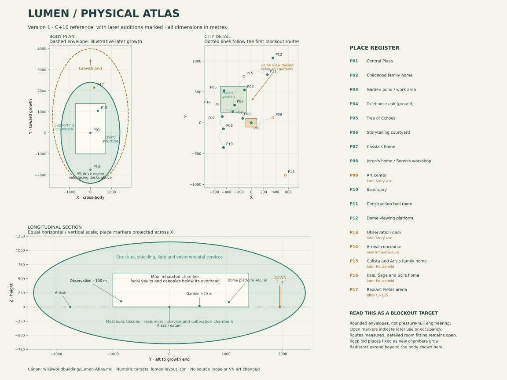

# Lumen: Physical Atlas

Part of the [Lumen world specification](Lumen.md#world-specification). **Working canon, version 1 (September 2026).** The arrangement and rounded scale are new additions. Coordinates and local dimensions are initial modelling targets, not recovered measurements of illustrations. Preserve the story and registered visual landmarks when refining them; record exceptions in [Lumen-Continuity.md](Lumen-Continuity.md).

## Shape and scale

Lumen has an elongated, rounded living body with branching structural ribs, inhabited chambers, metabolic tissues and space for growth. Its principal inhabited city occupies a broad central chamber with terraces and adjoining chambers. It is not a uniform stack of identical decks: a visitor encounters rooms, planted streets, wooded hollows, overlooks and open communal volumes.

| C+10 reference measure | Approximate extent | Meaning |
| --- | --- | --- |
| Main body | 4.8 km long × 2.8 km wide × 1.8 km deep | Outer bounding dimensions; excludes extended heat-rejection surfaces and arriving craft. |
| Main city chamber | 2.4 km long × 1.4 km wide | Plan envelope containing public open space, residential terraces and substantial voids. |
| Main chamber overhead | Up to about 600 m above the central plaza | A high enclosing structure; lower local vaults and tree canopies screen much of it. |
| Occupied terraces around the common basin | Generally 0–120 m above plaza datum | Connected by sloping routes, stairs and lifts; buildings have their own storeys. |
| Calista's childhood neighborhood | Roughly 600–900 m across | Family homes, gardens and local gathering spaces, not the whole city. |

The main body contains extensive nonresidential structure, voids and supporting systems. Its bounding box is not a solid mass or a single pressurized room. No mass, hull thickness or thrust can be calculated from these dimensions alone.

The principal chamber provides the visual relationship needed by the unfinished-dome scene: gardens and passages extend below a high internal viewpoint. Adjoining habitation chambers allow the vessel to exceed the visible city without requiring the children to see its entire body.

## Map convention

Use metres, with **(0, 0, 0) at Central Plaza's main paving**. +Y runs along the body toward the main growth end, +X across the body, and +Z upward. Everyday gravity points toward −Z throughout connected habitation. These are modelling directions, not inherited compass names or dialogue vocabulary. “Outer sections” means the developing edges of settlement, not necessarily the vacuum-facing skin.

The Book I body lies approximately within X = ±1,400 m, Y = ±2,400 m and Z = −650 to +1,150 m. Its rounded perimeter does not occupy every corner of this box. Structural organs and local chamber shapes must be fitted within the envelope during blockout.

The [diagram data](lumen-layout.json) records extents, place targets, traced blockout routes and camera studies. The [renderer](diagrams/render_lumen_atlas.py) regenerates the SVG. The diagram shows a spatial proposal, not a finished building plan; projected section markers can lie away from its cutting plane. The first [Blender blockout](../../world/lumen/lumen-blockout.blend) and [build instructions](../../world/lumen/README.md) provide the next scale-validation layer.

## Regions

The names below describe functions for the atlas. Only existing proper names such as Central Plaza, Maia's Garden and Radiant Fields are fixed story names. Houses and workshops are mixed through the city; a functional region is not an exclusive-use district.

| Region | Position and character | Main anchors |
| --- | --- | --- |
| Central common basin | Broad connected public space around the datum, with residential terraces rising around it | Central Plaza, market streets, cafés, civic gathering rooms. |
| Garden neighborhood | Lower terraces on the −X side, toward +Y from the plaza | Original family home, Maia's garden, treehouse, Tree of Echoes, Cassia's and Joren's households, storytelling courtyard. |
| Arts and making neighborhood | Along the +X edge of the basin, with studios elsewhere in homes | Art center, guild workshops, rehearsal and exhibition spaces. |
| Sanctuary and care neighborhood | Quieter −X/−Y terraces with direct routes to homes and public transit | First Breath rooms, counseling, clinical and Core Integration facilities. Birth and integration remain distinct services. |
| Productive gardens and metabolic chambers | Adjoining flanks and lower chambers | Crop cultivation, fermentation, water treatment, reservoirs, nutrient recovery. Household gardens also produce food. |
| Developing edge | +Y end of the early city chamber and its adjoining growth chambers | Construction passages, tool room, unfinished dome and internal scaffold platform. |
| Arrival and exchange chambers | −Y end, with docking openings to the sides | Local craft, expedition preparation, visitor reception, freight transfer. The aft drive area has a separate approach exclusion. |
| Radiant Fields, later | New +Y chambers beyond the early developing edge | Recreation streets, glass and planted towers, Luxa arena and practice fields. |

## Location targets

These centres locate places in the initial model. Typical tolerances are ±50 m for neighborhood anchors and ±150 m for outer infrastructure. Detailed room layouts and camera fitting may require smaller changes within those tolerances. Do not infer building size from a point marker.

| ID | Place | X, Y, Z in metres | Relationship to preserve |
| --- | --- | --- | --- |
| P01 | Central Plaza | 0, 0, 0 | The same physical square for festival, mourning and remembrance. |
| P02 | Childhood family home | −300, 180, 20 | Direct access to family garden; branching interior halls; Cali's room between her siblings' rooms. |
| P03 | Garden pond and work area | −270, 285, 20 | Shallow basin, reachable low bank, broad dry planting area; miniature wheel gets a small supplied flow. |
| P04 | Treehouse oak | −110, 530, 20 at ground | Far corner of Maia's wider garden; raised room around 5 m above this local ground in the first blockout, separate lower hollow. |
| P05 | Tree of Echoes | −440, 520, 22 | Separate tree in a wooded clearing, reached through a thicket. |
| P06 | Storytelling courtyard | −140, 70, 10 | Intimate gathering place, separate from the large plaza. |
| P07 | Cassia's home | −470, 100, 25 | Near the family neighborhood; books, craft and ecological work. |
| P08 | Joren's home / Soren's workshop | −450, −100, 30 | Household workshop distinct from Arin's, near paths toward other technical spaces. |
| P09 | Art center | 350, 80, 25 | Accessible from homes and marketplace; windows open to bright inhabited space. |
| P10 | Sanctuary | −450, −400, 25 | Calm internal rooms, ordinary public access, separate service access. |
| P11 | Construction tool room | 260, 780, 30 | Reachable along unfinished but enclosed paths. |
| P12 | Unfinished-dome viewing platform | 350, 1,050, 85 | Internal overlook facing back across the basin and garden neighborhood. |
| P13 | Observation deck | 550, −850, 100 | A later-used viewpoint with a protected actual view into space. |
| P14 | Arrival concourse | 0, −1,750, 0 | Transit connection to city, side-facing docks beyond. |
| P15 | Calista and Aris's family home | −120, 750, 35 | Later occupancy; distinct home with its own garden/studio, near the older family garden. |
| P16 | Kael, Sage and Sol's home | −550, 300, 30 | Separate household, convenient for frequent visits. |
| P17 | Radiant Fields arena | 180, 2,150, 30 | Later chamber, beyond the original inhabited city's edge. |

P15 and P16 designate later household occupancy, not an assertion that those buildings or families already exist in the Book I form. P13's exact commissioning date is open; its first required story use is in the later years.

P13 locates the observation deck's visitor area, not the outer skin itself. Reserve an outward-facing viewing recess and clear optical path through the adjoining flank chamber to a shuttered exterior aperture. Do not place an opaque intervening wall between the deck and its space view.

Maia's garden is a **stewarded garden landscape**, roughly 420 × 420 m in this layout, combining a family-adjacent working garden with publicly accessible planting, paths and wooded margins. Maia works with others and automated ecological systems. This preserves the wiki's inclusion of the Tree of Echoes without making the whole landscape a private backyard. The treehouse oak and the Tree of Echoes occupy different corners. Maia's festival planting reaches the plaza through displays and connected garden approaches; the entire garden need not occupy the square.

## Walking and transit

The following are route-length targets, longer than straight-line separations. Times use a leisurely 3 km/h (50 m/min), before stops; they are scene-planning estimates, not Astraviin physiology. The first blockout traces these paths in three dimensions. Substantial elevation changes have lifts as well as stairs and graded paths; the complete lift and accessible circulation network remains to be modelled. A childhood outing can take much longer because of exploration.

| Route | Path length target | Walking time |
| --- | ---: | ---: |
| Family home → pond | 140 m | 3 min |
| Family home → treehouse | 450 m | 9 min |
| Family home → Tree of Echoes | 550 m | 11 min |
| Family home → Central Plaza | 450 m | 9 min |
| Family home → Cassia's home | 250 m | 5 min |
| Family home → Joren's home | 450 m | 9 min |
| Family home → Sanctuary | 800 m | 16 min |
| Family home → art center | 850 m | 17 min |
| Family home → construction tool room | 1,050 m | 21 min |
| Tool room → dome approach | 400 m | 8 min, plus the scaffold climb |
| Plaza → arrival concourse | 2,100 m | 42 min, usually shortened by transit |
| Plaza → later Radiant Fields | 2,600 m | 52 min, usually shortened by transit |

Small shared passenger carriers run through enclosed peripheral routes, with stops near the plaza, care neighborhood, making spaces, arrivals and later recreation chambers. Goods use service routes and lifts. This adds infrastructure without inserting vehicle rides into the children's existing walks. Allow roughly 10–15 minutes for typical end-to-end transit trips including walking to stops and waiting; exact vehicle technology and schedules remain open.

## Plaza gathering capacity

The familiar stage, great tree and stair, arcades, central passage and occupied terraces form one coherent **plaza complex**. The principal square's approximate outline is 180 × 140 m; the initial model reserves about 11,000 m² of clear gathering area there and another 9,000 m² on surrounding terraces and connected courts, after space for planting, stage and circulation.

At a modelling allowance of 2 m² per participant, this 20,000 m² gathering allocation accommodates approximately 10,000 people. The existing VN view can show one part of it. It does not have to display every participant or all the rear terraces. Shared sound and unobtrusive relays extend performances beyond a direct sightline to the stage. Verify circulation and sightlines in the blockout; this allowance is not a completed crowd-flow design.

As Lumen grows, the connected gathering area expands toward approximately 60,000 m², enough for 26,000 residents plus visitors at the same allowance. Preserve the familiar central square and add connected spaces outside its existing views. Annual remembrance can continue there without rewriting “the entire community” as “a small neighborhood.” Nobody is obliged to attend every gathering, and care duties continue during festivals.

## Space budget

The C+10 starting budget counts useful area on each inhabited or working level; stacked surfaces are counted individually. It is **not** a sum of land parcels to fit on a single flat floor. Areas are mutually exclusive here: a home workshop included in residential floor area is not counted again as a guild workshop.

| Use | Area | Budget purpose |
| --- | ---: | --- |
| Residential interiors | 0.95 km² | Approximately 3,000 residential groupings. |
| Civic, care, education and substantial guild interiors | 0.35 km² | Sanctuary, clinics, art center, shared workshops and archives. |
| Public planted spaces, recreation and pedestrian circulation | 1.40 km² | Accessible garden surfaces, squares, paths and wooded clearings. |
| Dedicated food cultivation | 2.00 km² | Cultivated bed area across stacked chambers; an allocation to test against a diet, not a demonstrated yield. |
| Metabolic, industrial and maintenance workplaces | 0.65 km² | Working surfaces for processing and repair; bulk tanks and tissue also need volume. |
| Transport and arrival facilities | 0.30 km² | Carrier routes, concourses, cargo handling and associated service space. |
| Serviced expansion reserve | 0.55 km² | Space awaiting occupancy or fit-out, distinct from unprepared growth tissue. |
| **Total useful surface allocation** | **6.20 km²** | Open chamber volume, deep structure and tank volume are additional. |

Most everyday scenes occupy the 2.70 km² allocated to homes, communal interiors and public landscapes. The larger outer body provides support systems and expansion space. The allowance is intentionally generous, consistent with automation and garden-rich living; it does not establish closed-loop food sufficiency, energy output or structural feasibility.

## Growth without relocating memories

| Epoch | Approximate body length × width × depth | Geometry treatment |
| --- | --- | --- |
| C+10 | 4.8 × 2.8 × 1.8 km | Reference layout. |
| C+50 | 5.2 × 3.0 × 1.9 km | Adjacent terraces and chambers fitted out; newer family homes occupied. |
| C+125 | 6.0 × 3.4 × 2.1 km | Additional habitation and support volumes; retain the original neighborhood datum. |
| Illustrative C+150 | 6.4 × 3.6 × 2.2 km | Later recreation chambers and Radiant Fields in use. |

These are growth targets, not uniform scale factors. Keep the old home, oak, Echoes clearing and plaza in place while adding lobes and chambers, mainly toward +Y and along the flanks. Doors do not become larger merely because Lumen grows. The early unfinished dome can be completed and repurposed; it is not automatically the later Luxa arena.

Radiant Fields can first be shown in use after C+125. Its precise opening date remains unspecified. Earlier recreation exists without placing Luxa or its later district in Book I.

## First blockout results

The [editable Blender file](../../world/lumen/lumen-blockout.blend) contains nine scenes: body and supporting-area packing, childhood city, dome overlook, two treehouse views, pond, plaza performance area, gathering-area plan and later growth. [Build instructions](../../world/lumen/README.md) and a generated [measurement report](../../world/lumen/validation.json) accompany it. The report identifies the exact wiki-data revision by hash.

| Check | Result | Practical limit |
| --- | --- | --- |
| Body and surface budget | The 6.20 km² net surface allocation fits within the rounded body envelope, including the reserved headroom above the supporting-area trays. | The trays test packing of area. They are not a literal deck plan, allocated dwelling inventory, soil volume or closed engineering model. Street distribution remains a separate study. |
| Childhood walks | Home → pond **139 m / 2.8 min**; treehouse **438 m / 8.8 min**; Echoes **548 m / 11.0 min**; plaza **446 m / 8.9 min**; construction **1,027 m / 20.5 min**. | Polyline route measurements at 50 m/min, before stops. They do not constitute a complete navigation or accessibility audit. |
| Other routes | Cassia **263 m**, Joren **458 m**, Sanctuary **804 m**, art center **832 m**; plaza → arrivals **1,997 m**, later Fields **2,434 m**. | All twelve traced approaches are within 12% of their rounded targets. The steepest walking segment is about 7.7%; lifts and gentler alternatives remain to be assigned. |
| Dome approach and view | Tool room → scaffold base **437 m**, followed by a **55 m vertical ascent**. From an eye point at **(350, 1,044, 86.65)**, mesh ray casts reach the home roof and central square; **11 of 25** sampled garden patches are visible. | Sparse planting and simple building masses. Detailed foliage and architecture will need another view check. A visible neighborhood does not imply every room or plant is visible. |
| Treehouse | Test upper floor **5 m above local ground**, main floor **7 × 5 m**, doorway **1.1 m wide**; connected landing and ladder, a cut passage through the trunk, separate lower hollow and open bays. | Adjustable dimensions. The exterior and interior preserve the principal landmark arrangement, but exact silhouettes, joinery, full body clearances and dressing are not reconstructed. |
| Pond | Test basin **9 × 7 m**, water depth **0.35 m**, water **0.12 m below** dry bank and coping **0.06 m above** bank; broad dry work space. | A scale and level study. The final irregular shoreline and all rescue/contact poses still require detailed fitting. |
| Plaza | **20,000 m²** of separate gathering reservations: **11,000 m²** within the broad square and **9,000 m²** in two adjoining courts. A closer camera frames tree/stair left, passage behind and dais right. | The familiar performance area occupies only part of the complex. No completed crowd-flow, egress or sound design is claimed. Scale figures are not a full population simulation. |
| Growth | Later homes and Radiant Fields appear in a separate scene while the old places retain their coordinates. | The later envelope and arena are reservations; later interiors and detailed expansion services remain open. |

These studies required **modelling refinements only**: lowering the initial treehouse floor target from 7 m to 5 m, placing the dome camera near its railing, and fitting a more intimate performance camera within the larger plaza complex. None requires changing the manuscript, Ren'Py scenes or existing images. The [compatibility record](Lumen-Continuity.md#blockout-adjustment-record) records the distinctions.

Next geometry work should subdivide the occupied terraces into actual homes and public rooms, complete pedestrian/transit/service connections, fit the observation aperture, and refine local architecture against all relevant cameras. Rain, final lighting, dense planting, pressure boundaries and structural feasibility remain untested by these first meshes.
