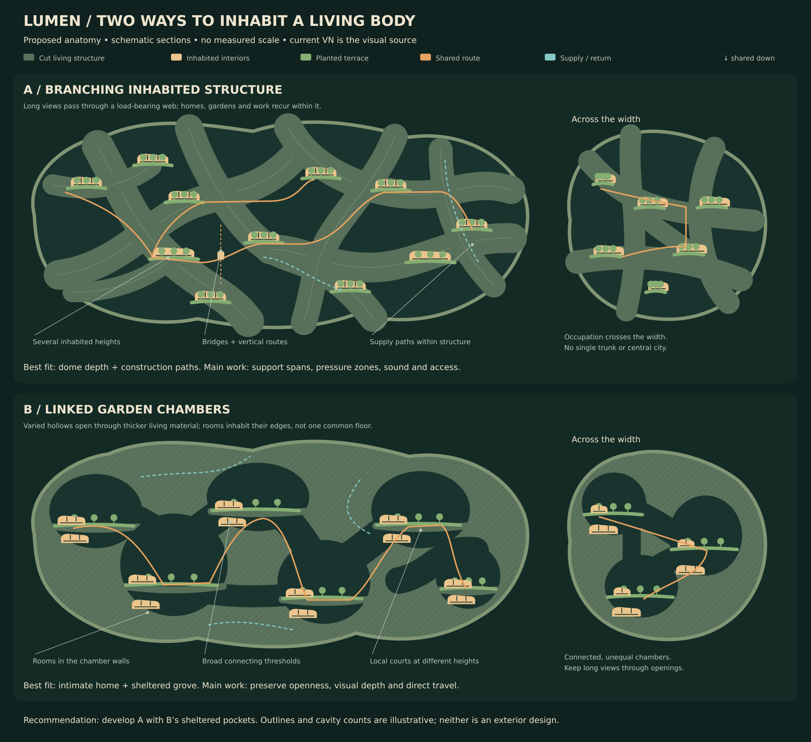

# Lumen: a world grown through its own body

**Design study · 6 September 2026 · proposed, not adopted canon**

This is the first study after restoring the pre-design tree. It recommends a direction for review, with alternatives and uncertainties exposed. The [Lumen article](Lumen.md) remains the canon overview. The rejected design remains on `reference/lumen-first-world-pass` at `b26d24e`; its dimensions, population, founding date and flat city plan are not inputs to this study.

**Start with the [Book I space inventory](Lumen-Space-Inventory.md).** It records the full VN narrative and Book I spatial program, including the rooms and working spaces omitted from this study's local drawings. The household and neighborhood sketches below are **withdrawn as layout bases** pending reconstruction from that program. The [visual review](lumen-study/review.html) retains selected VN plates and numerical probes for reference; none establishes a complete home or vessel layout.

## The direction

Lumen should feel like an inhabited, cultivated living being whose people gradually become part of its mind and body. Homes, gardens, work and public life extend through its depth. A familiar room can open onto a sheltered garden; a path can pass through thick living structure and emerge onto a balcony overlooking other neighborhoods above and below. The body has substantial width and depth as well as length.

The strongest starting point is **branching inhabited structure with sheltered garden chambers within it**. The VN's dome view supplies the connected depth; its home, courtyard, treehouse and construction scenes supply the intimate scale, material character and practical agency. The dome is one unfinished local structure encountered on an outing. It does not define Lumen's exterior or a roof over its entire population.

Following the author's population guidance, compare **6,000 and 18,000 embodied residents** during Calista's childhood, with **about 18,000 as the upper limit for that period**. The exact census remains open within the working 6,000–18,000 band. The proposed body range remains roughly **1.5–3 km long, 1–2 km wide and 0.8–1.6 km deep**. Population and dimensions are independent design probes, not a size derived from the paintings or paired engineering solutions. Lumen's later growth needs a separate population study. [The worksheet](lumen-study/Scale-and-Physics.md) explains the assumptions and why the larger body sizes may prove unnecessary.

## What controls this study

| Evidence | How it is used |
|---|---|
| Author's current direction | Artificial gravity is accepted; living, deeply inhabited anatomy and minimal story/art changes are requirements. A constellation is an adult romantic/peer relationship, not a family or housing unit. |
| Current VN runtime art and scenes | **Primary visual references.** Preserve recognizable local spaces, framing, routes, materials and scene actions. Images guide relationships; they do not establish exact dimensions or an unseen ship plan. |
| [Current manuscript](../../revision/latest.md) and [timeline](../TIMELINE.md) | Preserve events, relationships, growth and chronology across the full life story, including material not yet adapted. Flag disagreements instead of silently rewriting them. |
| Current wiki | Home for established and eventually settled canon. Distinguish summaries, hypotheses and older extrapolations when they disagree with the author or current story. |
| Older outside artwork | Secondary context only where compatible with the current VN. None is used as a core plate in this study. This supersedes the older reference ranking in the VN art-direction document for this redesign. |
| Real research | Tests consequences and identifies the speculative steps. It does not supply Lumen's visual design. |

The atlas separates **visible evidence**, **proposed interpretation** and **what the frame cannot establish**. All anatomy, region placement, dimensions and budgets below are proposals. No new demographic or physical claim has been promoted into the canon article.

## Two anatomies

These are diagrammatic sections, not finished exterior concepts or measured floor plans. Amber areas mark connected inhabited interiors within the structure; they are not rows of detached houses or a count of dwellings. The smaller transverse sketches test whether occupation continues across the width as well as through the height. Their individual cavities are illustrative, not registered slices of a completed 3D mesh.

| | A — Branching inhabited structure | B — Linked garden chambers |
|---|---|---|
| Basic organization | Thick, interconnected structural members contain rooms and services; terraces and bridges support gardens and public routes between them. Habitation recurs throughout the body. | A thicker living matrix contains varied, interlocking garden hollows. Homes and workspaces occupy their walls and terraces; broad thresholds connect adjacent hollows in three dimensions. |
| Everyday experience | Enclosure opens into long, partially obscured views across other inhabited heights. Local courts remain quiet and personal. | A sequence of intimate places with changing light and climate, punctuated by larger shared openings and overlooks. |
| Best VN fit | The dome panorama, branching construction path and occupied festival galleries. | The home, shaded courtyard and enclosed Tree of Echoes grove. |
| Main difficulty | Large connected air volumes need workable pressure boundaries, acoustic separation, maintenance access and support spans. Bridges cannot be the only accessible routes. | Excessive subdivision would obscure the dome's visual depth and make travel feel like tunnels between isolated atria. Openings must connect real neighborhoods. |
| Growth | New branches and enclosed rooms extend from several existing districts, with local scaffolding and access. | Hollows enlarge and join; new chambers mature beside existing ones. Existing occupied walls require staged work. |

**Recommendation: develop A, borrowing B's sheltered local spaces.** There is no mandatory central trunk, one civic core, repeated stack of identical decks or tree-shaped exterior. “Branching” describes connected structure and circulation; the larger anatomy need not literally be terrestrial wood. Homes and active public spaces belong on several inhabited heights, with other homes beneath gardens and beyond the edge of each drawing.

## A home, its garden and the spaces beyond

The unit to reconstruct is **the complete household spatial program**, including shared gathering and meal space, branching halls, each child's distinctive private room, personal provision for all five adults, cooking, art and unfinished projects, Arin's workshop, Selene's music room, Dorian's library, Sage's room, garden work and household support. These are compatible uses and connected spaces to resolve, not a fixed count of separate bedrooms or detached buildings. The manuscript places Kael's and Lyra's rooms on either side of Calista's. Selene's door is reached along a hall; the household fountain is audible beyond Sage's door. The exact attachment of Arin's workshop and Dorian's library remains to be mapped, without omitting either from family life. See the [source-linked inventory](Lumen-Space-Inventory.md#spaces-and-functions).

The author's clarification establishes **Maia's garden as ordinary household outdoor space**, without an implication of unusual wealth. The wider woods, treehouse surroundings and open areas are more shared. Keep four scales legible: personal privacy; shared household interiors and semi-private outdoors; places shared among nearby households; and wider community places. A visitor can reach a local path without crossing another household's living room or garden. A friend can be invited into that garden without its becoming a public thoroughfare.

The [previous household sketch](lumen-study/household-spaces.svg) is retained as an explicitly incomplete record, not a layout to extend. Its three named child rooms, central space and generic support labels did not represent the home’s full program. “Further rooms beyond view” was insufficient. The next drawing must carry the named work/quiet rooms and adult retreats, including any deliberate overlaps, as well as the whole treehouse refuge.

Preserve the garden's proximity and enclosure in `script.rpy:51–52` and the **planting-patch-to-oak-ladder sightline at `script.rpy:96`**. The wooded edge can connect to shared land without moving the treehouse away from the garden or converting its intimate upper/lower refuges into a public through-route. Exact boundaries remain open. Mark any later boundary or route discrepancy against the existing art before changing a scene.

## Regions as overlapping parts of a living world

These are functional groupings, not new canonical district names or exclusive zones. Distribute daily needs among neighborhoods; some specialized functions can be concentrated.

| Region or system | Proposed place in the anatomy | Existing scene it must support |
|---|---|---|
| Domestic interiors and household gardens | The complete domestic/work/retreat program occupies connected living structure, with household outdoor space meeting local paths. Other households occupy adjoining parts of the body, including above and below. | Central room and halls, all residents' private provision, kitchen/activity space, Arin's workshop, Selene's music room, Dorian's library, Sage's room, Maia's garden, Cassia's home and Joren's home. |
| Local shared landscapes and community groves | Woodland, play spaces and paths are shared among nearby households; larger landscapes and heritage places serve the wider community. Their root beds, drainage and canopy occupy real volume. These are distinct from household gardens even where the planting is continuous. | The broader wooded treehouse area, access to open spaces, and the **separate** Tree of Echoes. |
| Civic confluences | Several routes meet at local plazas. The named central plaza is a major social focus within this network, with occupied galleries and adjoining approaches. | Festival stage, lantern release, memorials and chance encounters. Its total gathering capacity remains unresolved. |
| Making, teaching and exchange | Household-associated work and quiet rooms coexist with shared guild facilities. Their users and thresholds differ; heavier processes need appropriate handling, heat and noise separation. | Arin's workshop, Soren's separate workshop, the construction equipment room, Selene's music room and Dorian's library must each remain accounted for. Guild workshops/archives and markets are additional wiki requirements with childhood extent unresolved. |
| Cultivation and metabolic systems | Productive terraces and specialist biological/technical spaces recur near supply routes. Water, nutrient and air circulation link regions through the structural matrix. | The wiki's automated routine production and cultivation, alongside Maia's deliberate gardening and real commerce. |
| Care and integration | Quiet, accessible spaces within inhabited districts, with protected support systems. Spatial provision for bodily care continues during gradual transcendence. | The Sanctuary, Sage's care, Core Integration at 35 and much later transcendence. There is no new mandatory central brain chamber. |
| Growth fronts | Several local seams of unfinished structure, reached from established paths; temporary staging coexists with mature spaces. | The construction room and successful dome ascent. Radiant Fields is a **later** addition, after Calista is 125, not a finished childhood district. |
| Exterior exchange | Docking, observation, heat rejection, shielding and propulsion interfaces connect to the body through controlled transitions. Their form and placement are still open. | Expeditions and the later observation deck with actual stars; preserve the early VN's gradual revelation of what Lumen is. |

## What makes it alive

Lumen's hum, botanical messages, responsive murals, light and temperature already make the world a participant. Extend that relationship into its operation: structure senses strain; maintenance redistributes material and repairs damage; cultivation and water circulation respond to actual conditions; inhabitants work with the organism to change their spaces. Routine work can be automated while choices, learning, gardening and craft remain personal.

**Proposed physical interpretation:** an engineered composite body combines living maintenance and sensing tissues with durable load-bearing materials and specialized technical organs. It uses finite matter and energy. Growth takes time and supplies; tools and scaffolds assist it. A garden has ecological needs, a door can provide privacy, and the ground remains dependable while the world responds around it. Neither instant reshaping nor omniscient intervention is needed to preserve the story's sense of wonder. This interpretation does not settle consciousness or identify nanomachines as the canonical mechanism.

Artificial gravity supplies a stable, familiar down direction across connected everyday spaces. Start the study with approximately Earthlike gravity; exact strength, mechanism and operating limits remain open. The older wiki's low-gravity VSB proposal is not a requirement for this redesign. [Physical foundations and research limits](lumen-study/Scale-and-Physics.md#physical-foundations) distinguish that accepted fictional allowance from conservation laws and speculative biotechnology.

## Reconstruct the local program before the next Blender section

The [previous neighborhood section](lumen-study/neighborhood.svg) is also withdrawn as a layout base. Its generic home/workshop symbols do not account for the named spaces, and its proposed path sequence has not been reconciled with the garden–ladder sightline. It retains an intention to inhabit several heights, but does not validate any story journey or place the dome beside the home.

Use the [45-record inventory](Lumen-Space-Inventory.md), its [scene map](Lumen-Space-Inventory.md#complete-scene-coverage) and [connections](Lumen-Space-Inventory.md#connections-to-preserve-or-resolve) to prepare the next section. Keep personal, household, local shared and wider community spaces legible while placing work, learning and care at their actual scales of use. The treehouse includes the upper room, ladder/landing, lower hollow with a second entrance and furnished lower refuge. Check all four, alongside the garden beds, pond banks, multiple-pond provision and mural.

A later Blender study should model this continuous section and a crossing through its width, then compare child-height views against the reference plates. Check home enclosure, garden/treehouse access, construction-path depth and the layered overlook individually. Include load paths, root/service space, accessible vertical movement and an alternate route. A successful section should reveal more inhabited space as the camera moves, while retaining somewhere a person could sit, cook, repair something or be alone.

## Compatibility and adjustment register

**No manuscript, VN script, runtime art or art manifest is changed by this study.** Minimal refinements look achievable, but whole-vessel compatibility is not yet demonstrated.

| ID | Evidence / potential conflict | Workaround to test first | Adjustment status |
|---|---|---|---|
| C01 | Dome panorama and manuscript ascent could be overread as the whole ship under one roof. | Make it an internal growth-site overlook into connected neighborhoods; preserve scaffold climb and afternoon lighting. | No text/art edit presently indicated. Needs camera comparison in 3D. |
| C02 | Manuscript Festival of Lights says the entire community gathers; VN shows an intimate stage, crowded paths and occupied galleries. | Test actual connected gathering surfaces and approaches for each population. Keep the stage and visible court at their present intimate scale. | **Unresolved scale constraint.** Do not silently redefine “community,” invent proven offscreen capacity or change the line. If capacity fails, revisit population first. |
| C03 | Home, pond and treehouse have recognizable geometry across backgrounds and action CGs. | Reconstruct local entrances, low pond bank and ladder/landing relationships before placing them in the larger anatomy. | No edit indicated by this study; any irreconcilable camera/detail discrepancy must receive a specific asset/scene entry later. |
| C04 | Bright skylight, artificial sky and rain must coexist with a deep inhabited body. | Distributed lighting/light delivery and local weather volumes; keep real stars at the later exterior-facing observation space. | Mechanisms proposed, not canon. No early starfield or exterior reveal added. |
| C05 | Wiki “grown rather than built” shorthand meets explicit construction and machinery in both current narratives. | Growth and skilled fabrication cooperate. Preserve repair, tools and construction time. | Future wiki clarification candidate; no storyline change needed for this interpretation. |
| C06 | Young Lumen, first locally born majority and later expansion lack a census or fixed founding date. | Model childhood separately from later epochs. Retain Radiant Fields as later growth. | Population, founding chronology and later dimensions remain proposals/open questions. |
| C07 | Joren's fatal research expedition follows the successful dome outing. | Preserve the separate moon expedition and unspecified malfunction. | No new gravity, construction or safety-system cause assigned. |
| C08 | Old gravity article and art-direction reference ranking conflict with current author direction. | Use accepted artificial gravity and current VN visual priority in this study. | Later wiki/production-document alignment is marked; neither older proposal controls the drawings. |
| C09 | The first study's repeated house-shaped symbols and isolated home outline implied a collection of houses and a private estate; the replacement still omitted essential domestic/work spaces. | Reconstruct the complete household program, including work, care, private retreats and ordinary indoor/outdoor life. | **The replacement household and neighborhood sketches are withdrawn as layout bases.** No new wealth status or manuscript/VN edit assigned. |
| C10 | The garden folds around the home in the VN; the treehouse is at a wooded garden edge in the source material. The author distinguishes household garden from broader shared woodland. | Preserve the close household garden and its privacy; let the wooded edge connect to shared local landscapes. Show paths and thresholds without treating all greenery as one ownership area. | Access distinction recorded in the wiki. Exact boundary and camera geometry remain to be mapped; no scene wording or artwork changed. |
| C11 | The VN explicitly uses Arin's workshop, Selene's music room, Dorian's library and Sage's room. Book I also gives every resident a private space. The study did not account for that program. | Preserve each required use; explicitly record shared uses or unplaced attachments. Keep Soren's workshop and construction equipment room separate. Reconsider the area allowances after fitting the program. | Inventory and retrieval coverage added. **This is a study omission; no VN/manuscript refinement is required to restore these spaces.** |
| C12 | The VN shows one recurring basin, while prose mentions multiple garden ponds. The treehouse has occupied spaces both above and below. | Distinguish image states and reused scenery from total location counts; reconstruct the lower refuge and separate entrance as well as the upper room. | Recorded in the inventory. No story/art change assigned; geometric reconciliation still required. |
| C13 | The VN explicitly sees the oak ladder from the planting patch; the privacy sketch did not test that sightline. | Fit household/local shared thresholds around the established proximity and view. | Sketch withdrawn; preserve the scene and adjust the proposed layout first. |
| C14 | The festival prose calls Maia's garden a centerpiece; the VN already shows floral work she prepared beside the plaza stage. | Preserve that existing staging without transporting the household garden to the plaza or making the family own the civic square. | Ambiguity recorded. No manuscript rewrite currently required; confirm interpretation during plaza design. |

The next design work is to place the complete local program and its source-backed connections before selecting dimensions. Keep explicit allowances for required spaces outside a modeled slice and retain unknowns instead of silently dropping them. Extend the inventory through Books II–IV before claiming whole-life coverage. Broader modeling and final population/size choices follow those checks; the numeric worksheet alone cannot validate Lumen's look or lived experience.
