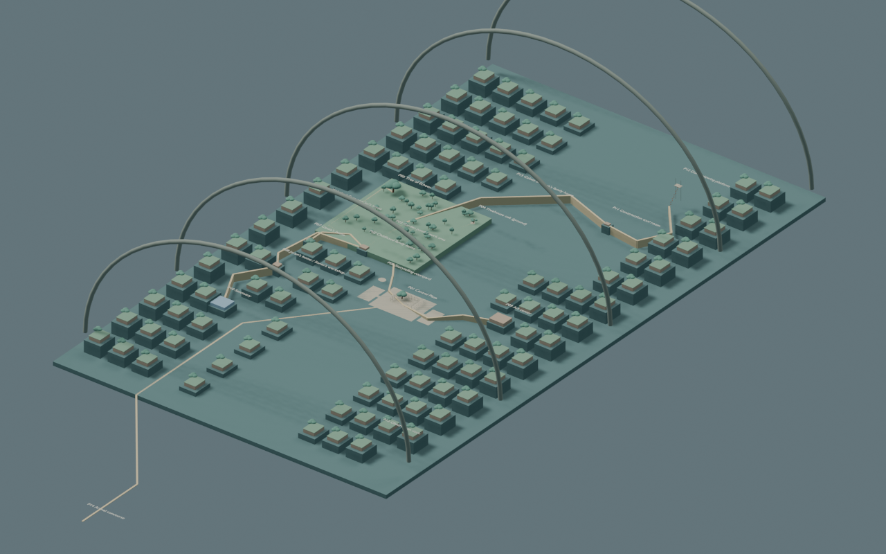
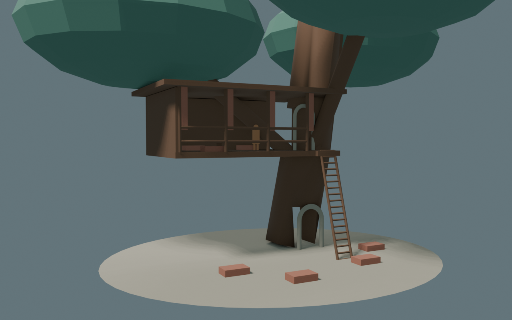
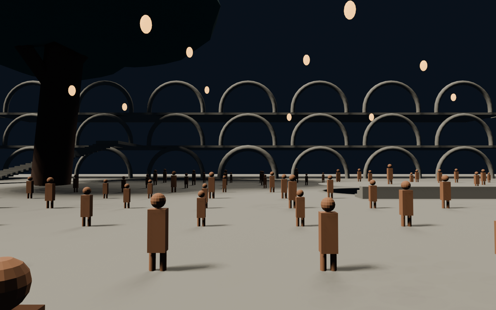

# Lumen in Blender

Open [lumen-blockout.blend](lumen-blockout.blend). This is the first author-facing scale blockout: an editable vessel envelope, city, supporting-area reservations, walking routes, local continuity studies and a later growth state. One Blender unit is one metre; down is −Z.

The [wiki atlas](../../wiki/worldbuilding/Lumen-Atlas.md) owns the layout and its interpretation. [lumen-layout.json](../../wiki/worldbuilding/lumen-layout.json) supplies the shared numerical targets. The Blender file is generated from those targets. It does not establish separate canon, approve a new VN background, or reproduce every illustrated detail.

## Explore

Choose a scene from Blender's top scene selector:

| Scene | Purpose |
| --- | --- |
| 01 Body and support allocation | Rounded body envelope and packing of net area allowances. Colored trays are reservations, not literal finished decks or crops. |
| 02 Childhood city | Garden neighborhood, plaza, construction edge and walking routes at the C+10 reference. Opens here by default. |
| 03 Dome overlook | Internal view across the city from the scaffold platform. |
| 04–05 Treehouse | Connected upper room, landing and ladder; separate lower hollow; open viewing bays. |
| 06 Pond and bank | A shallow basin with low coping, broad working bank, left inlet and right lily group. |
| 07 Plaza performance area | Great tree/stair left, rear passage, surrounding arcades and stage right. Figures indicate scale, not a complete event crowd. |
| 08 Plaza capacity plan | Measured gathering reservations; performance architecture occupies a portion of the wider complex. |
| 09 Later growth | Earlier landmarks stay fixed; later households and Radiant Fields are added. |

Numpad **0** switches into/out of the saved camera. Select a named object in the Outliner and use Numpad **.** to frame it. Collections separate routes, enclosure guides, supporting areas and individual location studies. The `START HERE` text block inside the file records these conventions.







All nine camera previews are in [renders](renders). Materials, planting and repetitive building masses are diagrammatic proxies. A colored tray reserves net floor area; it is not an additional building to place over the depicted streets. The city and area-packing scenes answer different questions.

## Rebuild

From the repository root, using the installed Blender:

```bash
blender --background --factory-startup --python-exit-code 1 --python world/lumen/build.py
```

To regenerate the PNG previews on Linux without an active display:

```bash
xvfb-run -a blender --background --factory-startup --python-exit-code 1 --python world/lumen/build.py -- --render
```

The script resolves paths relative to itself and uses only Blender's bundled Python modules. It was run with Blender 4.0.2 and EEVEE. It rewrites the generated `.blend`, [validation.json](validation.json), and, when requested, the previews. Save manual modelling in a different `.blend` file before rebuilding. Later Blender releases may need render-engine API adjustments.

## What was checked

The generated report contains the wiki-data hash, measured route lengths and slopes, net mesh surface areas, supporting-space clearance inside the body envelope, dome sightline ray casts, connected treehouse entry, and projected landmark ordering/framing. The [atlas's blockout results](../../wiki/worldbuilding/Lumen-Atlas.md#first-blockout-results) explain the findings and the modelling refinements.

This establishes a workable starting scale. Detailed room plans, full circulation and accessibility, pressure compartments, structural loads, food/energy closure, dense planting and final camera reconstruction remain to be designed. The observation aperture is reserved in the atlas but is not yet modelled. The current renders do not test rain simulation or reproduce final lighting.

The manuscript, Ren'Py storyline, VN images and review manifests are unchanged. Any future conflict requiring one of those to change belongs in the wiki's [compatibility register](../../wiki/worldbuilding/Lumen-Continuity.md), alongside the smallest proposed adjustment.
